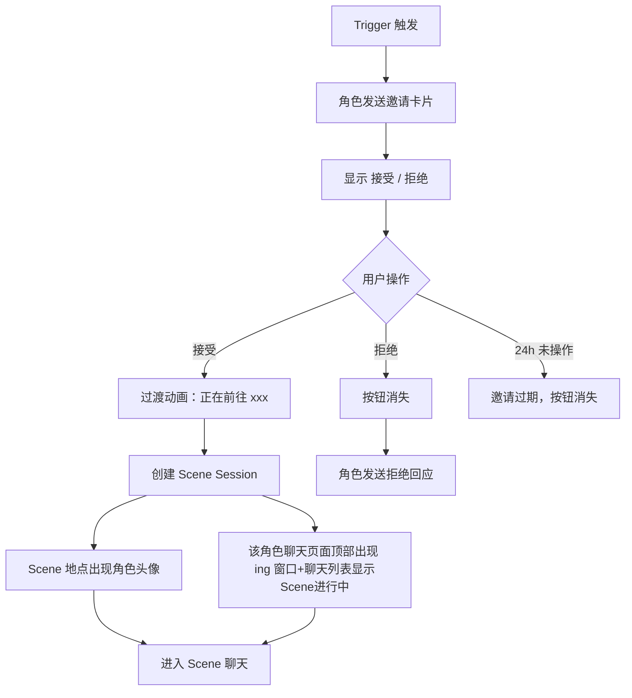

# 1\.0版本需求文档

# ✅背景 \& 介绍

- Idol 101 验证了 Kpop 粉丝对 AI 角色陪伴的基础需求——用户愿意和虚拟偶像聊天，也愿意为这种聊天功能付费。但 101 暴露出一个核心问题：关系没有生长感。用户在第 7 天和第 30 天的体验本质相同，聊天记录只是在堆叠，关系没有演进。

|**问题**|**表现**|**不解决的代价**|
|---|---|---|
|关系无演进感|D14 留存曲线急剧下滑|30 日留存无法改善，LTV 天花板低|
|交互场景单一|仅有 Chat，新鲜感输入匮乏|付费转化依赖功能噱头而非关系深度|
|回忆无积累|聊天记录无法转化为「共同经历」叙事|用户情感投入浅，迁移成本低|

*102 核心假设：通过 Scene 系统和 Memory 架构，让用户和角色共同「经历」可回溯的事件，使关系产生真实的时间厚度。*

# ✅目标用户

> [用户分析\&市场分析](https://laientech.feishu.cn/docx/WEuVdfQUToMRDVxMCzFcDFqAnve?from=from_copylink)
> 
> 

**主要用户：** 18–28 岁女性，德国市场，Stray Kids 粉丝，渴望与虚拟角色建立真实、持续关系的 K\-pop 粉丝

**用户目标：** 通过日常生活场景的持续互动，让关系真实生长、记忆不断积累，感受到"这个角色真的认识我、也在意我"

**次要用户：** 轻度好奇用户，偶尔进入但不高频使用 Scene

# ✅Epic Hypothesis

**我们相信：** 如果为用户和 AI 角色提供有空间感的可互动生活场景，并将每次场景经历转化为可回溯的记忆（拍立得），用户会感受到关系的真实演进，从而提升 D14 留存和 Scene 使用频次。

**目标用户：** 渴望与虚拟角色建立持续关系的 K\-pop 粉丝

**预期结果：** D14 留存回升；Scene 使用频次 ≥ 2次/周/活跃用户；Scene 完成率 ≥ 60%

**验证方式：** 内测期追踪 Scene 进入率、完成率、拍立得生成数、D7/D14 留存对比

# ✅功能范围

|模块|做什么|详情文档|
|---|---|---|
|开屏 \& 登录|Google / Apple / 邮箱登录；条款同意；自动登录\(15天\)；按 OB 状态路由|[《开屏与登录模块》](https://laientech.feishu.cn/wiki/AdWowSkQXiPbCCke2P4cHThZn4f?fromScene=spaceOverview#share-FbLxdEOSnowZyAxJh4CcUBgFnRh)<br>|
|OB 新用户引导|选角 → 演唱会后台小剧场 → 楼下首次偶遇 → 加好友 → 落地 Home；强制线性、解锁全站|[《OB 模块》](https://laientech.feishu.cn/wiki/AdWowSkQXiPbCCke2P4cHThZn4f?fromScene=spaceOverview#share-VA8zdckgloUrc5x6a0Mcr7UDnm3)|
|Home|角色海报 \+ 相识天数 \+ 拍立得故事线（按天）；多角色切换；拍立得预览/回顾/编辑|[《Home 模块》](https://laientech.feishu.cn/wiki/AdWowSkQXiPbCCke2P4cHThZn4f?fromScene=spaceOverview#share-ELp4diZCjoOSG4x6e9pcXiDUnED)|
|Chat|会话列表 \+ Discover Members 加好友 \+ 对话页 \+ Chat Settings \+ 举报；沿用 101 聊天能力|[《Chat 模块》](https://laientech.feishu.cn/wiki/AdWowSkQXiPbCCke2P4cHThZn4f?fromScene=spaceOverview#share-WoNhd85S6oBUOwxsvPPcxZrnnMb)|
|Scene|街区地图 \+ 地点/事件 \+ 两条发起路径\(用户/Trigger\) \+ 进行中表现 \+ 离开生成拍立得|[《Scene 模块》](https://laientech.feishu.cn/wiki/AdWowSkQXiPbCCke2P4cHThZn4f?fromScene=spaceOverview#share-Sav1dIalYovG51xG3xpcv6EsnzF)|
|Me|用户头像/背景/昵称、UID/邮箱\(可绑定\)、评分、反馈、隐私条款、登出、注销|[《Me 模块》](https://laientech.feishu.cn/wiki/AdWowSkQXiPbCCke2P4cHThZn4f?fromScene=spaceOverview#share-I0y9deoXvo47yNxlXAUcGRaxnhf)|
|Memory 系统|四类记忆，支撑聊天/Scene 连续性|[独立《Memory 文档》](https://loquacious-starburst-b2f1bc.netlify.app/)|
|Trigger 系统|角色主动发起 Scene 邀请|独立《Trigger 文档》|
|Scene 对话|控制对话输出（开场话外音、角色回复、离场钩子、总结scene）|独立《Scene对话文档》|

# ✅产品功能架构

1. **模块依赖图**

```mermaid
flowchart TD
  LOGIN["开屏&登录"] -->|"ob_status 路由"| OB["OB 引导"]
  LOGIN -->|"已完成"| HOME["Home"]
  OB -->|"完成:加好友+拍立得+解锁"| HOME
  OB -->|"注入首条消息"| CHAT["Chat"]
  HOME <-->|"切换角色/海报昵称"| CHAT
  CHAT -->|"右上角 Scene 按钮"| SCENE["Scene"]
  SCENE -->|"邀请卡片插入会话"| CHAT
  SCENE -->|"完成生成拍立得"| HOME
  CHAT -->|"加好友"| HOME
  ME["Me"] -.->|"用户资料/语言设置"| CHAT
  MEM["Memory系统"] -.->|"支撑对话连续性"| CHAT
  MEM -.-> SCENE
  TRIG["Trigger系统"] -.->|"角色主动发起"| SCENE
  HOOK["离场钩子"] -.->|"Scene收束"| SCENE```

2. **核心数据流向**

|数据|产生处|流向 / 被谁消费|
|---|---|---|
|`ob_status` / `ob_progress`|OB 过程|登录路由、全站锁定|
|已添加角色（好友关系）|Chat 加好友 / OB|Home\(海报切换\)、Scene\(选角\)、Chat\(列表\)|
|角色资料（昵称/头像/海报/背景）|Chat Settings|全局所有展示该角色处同步|
|Scene Session|Scene 发起|进行中表现、离场钩子、生成拍立得|
|拍立得（按天）|Scene 完成|Home 故事线、预览/回顾/编辑|
|记忆（四类）|聊天 / Scene|回流 Chat \& Scene 的角色回复|
|用户资料（昵称/邮箱/语言）|Me|显示层 \+ 翻译/语言设置|

3. **关键约束**

- 同一时间仅 1 个 Active Scene；进行中仅锁当前角色，其他角色普通 Chat 不受影响。

- 角色资料改动全局同步（昵称/头像）。

- 拍立得编辑仅展示层，不回写记忆数据。

4. **端到端串联流程（用户完整旅程）**

```mermaid
flowchart TD
  A["App 启动 / 开屏"] --> B{"登录态有效?(≤15天)"}
  B -->|"无效/首次"| C["登录页<br/>Google/Apple/Email + 条款"]
  B -->|"有效"| D{"ob_status?"}
  C --> D
  D -->|"未完成"| E["OB: 选角→后台小剧场<br/>→楼下偶遇→加好友"]
  D -->|"已完成"| H["落地 Home"]
  E -->|"完成:拍立得+解锁全站"| H
  H --> LOOP["日常循环"]
  LOOP --> CH["Chat 聊天<br/>(沿用101+记忆)"]
  LOOP --> SC["Scene 发起<br/>(用户/Trigger)"]
  CH -->|"加好友"| DISC["Discover 扩列"]
  CH -->|"Scene按钮"| SC
  SC -->|"完成"| POL["生成拍立得<br/>挂Home对应天"]
  POL --> H
  DISC --> H```


# ✅开屏 \& 登录模块

## 开屏 / 登录主页

1. **文案**

|元素|文案（英文为准）|
|---|---|
|品牌名|`OPPAYA`（写死，含兔子吉祥物 Logo）|
|主标题|`CONNECTING BEYOND BOUNDARIES`|
|副标题|`A DIFFERENT KIND OF CLOSENESS`|
|按钮 1|`Continue with Google`|
|按钮 2|`Continue with Apple`|
|按钮 3|`Continue with Email`|
|条款同意（按钮下方）|`By continuing, you agree to OPPAYA's Terms of Use and Privacy Policy.`（`Terms of Use` / `Privacy Policy` 为可点击链接）|
|未勾选拦截弹窗|`Please agree to the Terms of Use and Privacy Policy to continue.`|

2. **图片\+样式**

- 背景：星空 / 暗紫渐变氛围底图（已提供，**前端写死**，资源包内置）

- 品牌区：兔子 Logo \+ `OPPAYA` 字标 \+ 主副标题，垂直居中偏上

- 登录区：底部三个等宽圆角按钮，深色半透明卡片，从上到下 Google / Apple / Email，左侧各带品牌 icon

- 安全区：按钮区贴底，预留 iOS 底部 Home Indicator 安全间距

- 条款同意：三个登录按钮**下方**居中放勾选框 \+ 同意文案

3. **交互**

|操作|行为|
|---|---|
|点击 `Continue with Google`|发起 **Google Sign\-In \(OAuth\)**，拉起系统/SDK 授权弹层；授权成功 → 拿 token 调后端登录接口|
|点击 `Continue with Apple`|发起 **Sign in with Apple**，拉起系统授权；成功 → 拿 identityToken 调后端登录接口|
|点击 `Continue with Email`|进入**邮箱登录二级页**|

- 三方授权与后端登录均为异步，期间按钮进入 loading 态、禁止重复点击。

- **账号创建**：首次用某方式认证成功即由后端创建账号（静默注册），无独立注册流程。

4. **数据来源**

|元素|归属|
|---|---|
|开屏底图 / Logo / 标题文案|**前端写死**（文案走 i18n）|
|Google / Apple 授权|**第三方 SDK**|
|用 token 换取登录态|**后端接口** `POST /auth/login`|
|登录后路由判断|**后端** `GET /ob/status`|

5. **边界**

|场景|处理|
|---|---|
|**加载态**|点击任一登录方式后，对应按钮显示 loading，其余按钮置灰禁用|
|**三方授权被用户取消**|静默返回开屏，无报错弹窗|
|**三方授权失败 / 网络错误**|Toast：`"Sign-in failed. Please try again."` \+ 解除按钮 loading|
|**后端登录接口失败**|Toast：`"Login failed. Please try again."` \+ 解除 loading|
|**首次冷启动判断登录态**|**已登录且登录态有效（≤15 天）的用户跳过本页**：开屏静默校验本地登录态，有效则直接走路由（开屏期间不闪现登录按钮）；无效/过期 → 正常展示登录页。|
|**未勾选条款点登录**|弹出 `Please agree to the Terms of Use and Privacy Policy to continue.` \+ OK；不发起授权、不跳转，停留当前页|
|**退出**|本页杀进程 → 下次重新走开屏|

6. **登录态生命周期（自动登录）**

- 凭证与存储

|项|规则|
|---|---|
|凭证类型|后端在登录成功（`POST /auth/login` 或 `/auth/email/verify`）后下发 `access_token` \+ `refresh_token`（或等价长效凭证），有效期 **15 天**|
|有效期计算|自**最近一次成功认证/续期**起算 15 天（即 `session_expires_at = last_auth_at + 15d`）|
|存储位置|iOS **Keychain**（不可用 UserDefaults，安全要求）；凭证由 App 持有，**禁止出现在 URL 参数或日志中**|
|续期方式|**滑动续期**：有效期内每次成功带 token 访问，后端把 15 天窗口顺延（活跃用户基本不掉线）|

- **冷启动判定流程**

    ```mermaid
    flowchart LR
  A["App 冷启动 / 开屏"] --> B{"本地有登录态?"}
  B -->|"无"| L["展示开屏登录页"]
  B -->|"有"| C{"本地判断是否过期<br/>(now < session_expires_at)"}
  C -->|"已过期"| L
  C -->|"未过期"| D["静默校验 / 续期<br/>GET /ob/status 携带 token"]
  D -->|"token 有效"| E{"读取 ob_status"}
  E -->|"未完成"| E1["进 OB / OB 断点"]
  E -->|"已完成"| E2["主界面 · 默认 Home tab"]
  D -.->|"token 失效(401)"| L    ```

    - 开屏期间**先本地判过期**（避免无谓请求），未过期再带 token 静默校验；整个过程**不闪现登录按钮**。

    - 静默校验失败（后端返回 401/token 失效）→ 清除本地登录态 → 回落到登录页，**不报错弹窗**（用户只看到正常登录页）。

- **过期 / 失效处理**

|场景|处理|
|---|---|
|登录态自然过期（\>15 天未活跃，且用固定 15 天策略）|下次冷启动直接展示登录页，需重新登录|
|使用中 token 失效（任意接口返回 401）|全局拦截：清除本地登录态 → 跳回开屏登录页；当前操作中断，**不静默重试**|
|用户主动登出（Me → Sign Out，OB 后才有入口）|清除本地登录态（Keychain）→ 回开屏登录页；**数据保留**|
|重新登录后|同一账号重新认证，原有数据/OB 进度按 `user_id` 恢复，与本地无关|

- **数据来源**

|元素|归属|
|---|---|
|token 签发 / 有效期 / 续期|**后端**|
|本地存储与过期判断、401 全局拦截|**前端**（Keychain）|
|静默校验|**后端** `GET /ob/status`（复用，带 token）|

7. **条款同意**

> 同时出现在**开屏登录页**（三个登录方式下方）和**邮箱登录二级页**（登录按钮下方）。
> 
> 

- **文案**

|元素|文案|
|---|---|
|同意说明（勾选框右侧）|`By continuing, you agree to OPPAYA's Terms of Use and Privacy Policy.`|
|链接 1|`Terms of Use` → 点击打开内嵌 WebView|
|链接 2|`Privacy Policy` → 点击打开内嵌 WebView|
|未勾选拦截Toast弹窗|正文 `Please agree to the Terms of Use and Privacy Policy to continue.` |

- **样式**

    - 勾选框（checkbox）\+ 同意说明文字，位于登录方式下方居中。

    - `Terms of Use` 与 `Privacy Policy` 高亮（下划线\+亮色），其余为次级灰字。

    - 勾选框**默认未勾选**。

- **交互 / 拦截逻辑**

    |    操作|    已勾选|    未勾选|
    |---|---|---|
    |    点击任一登录方式（Google / Apple / Continue with Email）|    正常执行|    **拦截**：弹出未勾选提示弹窗，**不发起授权、不跳转邮箱页**；2s后自动关闭，停留当前页|
    |    邮箱页点击登录动作|    正常执行|    同上拦截|
    |    点击 `Terms of Use` / `Privacy Policy`|    打开 WebView|    打开 WebView（**查看条款本身不需要勾选**）|

    - **拦截发生在「执行认证动作」时刻**，而非进入页面时。即未勾选也能浏览页面、查看条款。

    - 邮箱二级页拦截的具体动作（`Log In`）

    - **跨页勾选状态**：建议**共享**——开屏页勾选后进入邮箱页保持已勾选；反之亦然。

    - 链接目标：复用 Me 模块的隐私政策 / 服务条款 WebView 地址。

- **数据来源**

|元素|归属|
|---|---|
|同意文案 / 弹窗文案|**前端写死**|
|Terms of Use / Privacy Policy 页面内容|**内嵌 WebView（待提供链接）**|
|勾选状态|**前端本地态**（不需后端存储）|

## 邮箱登录二级页

> 单页内分两步：先填邮箱发码 → 再填验证码登录。无独立注册页（验证通过即登录/注册）。
> 
> 

1. **页面结构与文案**

|元素|文案（英文为准）|说明|
|---|---|---|
|返回按钮|`←`（左上角）|返回开屏页|
|页面标题|`Continue with Email` ||
|邮箱输入框|placeholder：`Enter your email`|键盘类型 = email|
|发送验证码按钮|初始：`Send Code`；点击后：`Resend (60s)`|仅邮箱有输入内容后高亮可点|
|验证码输入框|placeholder：`Enter 6-digit code`|键盘类型 = number，长度 `6` |
|登录按钮|`Log In` |仅验证码填满后高亮可点|
|条款同意（登录按钮下方）|勾选框 \+ `By continuing, you agree to OPPAYA's Terms of Use and Privacy Policy.`|未勾选点登录动作弹窗拦截|

2. **交互流程**

```mermaid
flowchart LR
  A["填写邮箱"] --> B{"点击 Send Code<br/>邮箱格式校验"}
  B -->|"格式错误"| B1["输入框下方红字<br/>Invalid email"]
  B -->|"格式正确"| C["调发码接口"]
  C -->|"成功"| D["弹窗: Code sent,<br/>please check your inbox"]
  D --> E["按钮变 Resend(60s)<br/>开始倒计时"]
  C -.->|"失败/限频"| C1["Toast 错误提示"]
  E --> F["用户输入验证码"]
  F --> G{"点击 Log In<br/>调校验接口"}
  G -->|"验证码错误"| G1["红字: Incorrect code"]
  G -->|"验证码过期"| G2["红字: Code expired,<br/>resend"]
  G -->|"成功"| H["登录成功<br/>→ 路由判断"]
  E -.->|"倒计时归0"| I["按钮恢复 Send Code<br/>可重新发送"]```

3. **发送验证码按钮 — 倒计时逻辑**

|阶段|按钮文案|可点|说明|
|---|---|---|---|
|初始|`Send Code`|✅|邮箱输入有内容才允许点（格式错时点击触发格式校验红字，不发请求）|
|点击后|`Resend (60s)`<br>|❌|立即弹窗 `"Code sent, please check your inbox"`；按钮置灰 \+ 倒计时 `60 → 0` 每秒 \-1 |
|倒计时中|`Resend (Ns)`|❌|整个倒计时期间不可重发|
|倒计时归 0|`Send Code`|✅|恢复可点，可重新发送|

- 倒计时**前端驱动**展示，但验证码**有效期由后端控制**

- 弹窗样式：轻量 Toast 或顶部条均可，**不阻断**用户继续输入验证码。

- **页面退出再回来**：倒计时是否续算？建议后端返回 `next_resend_at` 时间戳，前端据此恢复倒计时（防止杀进程绕过限频）。

4. **异常 / 校验状态（全量）**

|触发|提示位置|文案|
|---|---|---|
|邮箱格式错误（点 Send Code 时校验）|邮箱框下方红字|`Please enter a valid email address`|
|发码接口失败（网络）|Toast|`Failed to send code. Please try again.`|
|验证码错误|验证码框下方红字|`Incorrect code. Please try again.`|
|验证码过期|验证码框下方红字|`Code expired. Please resend.`|
|登录接口失败（网络）|Toast|`Login failed. Please try again.`|

- 红字校验态在用户重新编辑对应输入框时自动清除。

- 登录按钮在验证码长度不足时保持灰显不可点。

5. **数据来源**

|元素|归属|说明|
|---|---|---|
|页面文案 / placeholder|**前端写死**||
|邮箱格式校验|**前端正则**（轻校验）\+ 后端兜底||
|倒计时数字展示|**前端**|时长/恢复时机由后端 `next_resend_at` 约束|
|发送验证码|**后端接口** `POST /auth/email/send-code`|后端控制有效期（建议 5min）|
|验证码校验 \+ 登录|**后端接口** `POST /auth/email/verify`|校验通过即登录/注册，返回登录态|

6. **边界**

|场景|处理|
|---|---|
|**发码加载态**|点击 Send Code 到接口返回前，按钮短 loading，防重复点击|
|**登录加载态**|点击 Log In 到返回前，按钮 loading \+ 禁用|
|**未填邮箱直接点 Log In**|不应发生（无验证码）；若发生则提示先获取验证码|
|**退出（返回开屏）**|已输入内容不保留|
|**杀进程**|重进走开屏；未完成验证码流程不保留断点|

# ✅OB模块

- **主流程图**

```mermaid
flowchart LR
  A["选角色页"] -->|"点击CTA(不可逆)"| B["B.演唱会后台小剧场<br/>BACKSTAGE·5轮预设选项"]
  B --> C["第5轮后<br/>staff敲门话外音→角色3连回复<br/>→单选项Okay I will wait"]
  C --> C2["点选项→变暗→旁白<br/>剪影破碎→闪烁3次"]
  C2 --> D["ERROR页<br/>STORY DISTURBED"]
  D -->|"Reload"| E["转场<br/>THEN→Hey careful→OPEN YOUR EYES"]
  E --> F["C.楼下小剧场<br/>Outside JYP"]
  F --> G["Backstory+3选项→话外音2<br/>→角色第一句→5轮实时对话"]
  G --> H["第5句后角色三段回复<br/>回应+离开+加联系方式"]
  H -->|"输入框变Okay按钮→点击"| I["Toast:Added as friend<br/>OB完成"]
  I --> J["拍立得#1挂Home+解锁全站<br/>→落地(Chat/Home待定)"]```

- **异常 / 退出 / 断点流程图**

```mermaid
flowchart LR
  K["任意OB节点<br/>杀进程/闪退"] -.-> R{"读取ob_progress"}
  R -.->|"not_started"| S1["选角色页"]
  R -.->|"character_selected"| S2["梦境剧场第1轮"]
  R -.->|"theater_in_progress"| S2
  R -.->|"theater_done(乱码态)"| S3["直接落ERROR页"]
  R -.->|"transition_done"| S4["楼下小剧场起点<br/>Backstory+3选项"]
  R -.->|"first_scene_in_progress"| S4
  R -.->|"completed"| S5["主界面·默认Chat tab"]```

## 选择角色\-\-阶段A

> 设计稿：全屏角色图片 \+ 顶部 hero 文案 \+ 左右箭头切换 \+ 底部信息卡 \+ 页码 dots \+ 底部 CTA。
> 
> 

1. **文案**

|元素|文案（英文为准，i18n）|
|---|---|
|顶部 hero 标题（全局固定，不随角色变）|`Unlock the story meant only for you.`|
|角色姓名|飞书表格字段Name|
|角色介绍（2–4 行，前端写死）<br>|例（Bang Chan）：`He looks after everyone. But if he ever lets you see the tired parts he hides from the world, something has changed.`|
|底部 CTA|`STEP INTO HIS WORLD`（点击即确认；静态写死，`HIS` 对 8 位男性成员均成立）|

2. **图片\&样式**

- 全屏角色立绘背景；hero 文案叠加立绘上（白字 \+ 阴影/微光保证可读）。

- 立绘左右两侧各一个圆形半透明箭头 `‹` `›`。

- 底部信息卡：深色半透明圆角卡，含姓名（大号粗体）\+ 介绍（次级灰字）。

- 信息卡下方：页码 dots，高亮当前页。

- 最底部：粉色渐变 CTA，贴底留 iOS 安全区。

3. **交互**

- 点 `‹` `›` 或左右滑动切换角色，dots 同步高亮。

- 左右切换到头：无限循环

- 点底部 CTA = **确认当前居中角色，点击即确认 = 不可逆点**。

- 必须选一个才能继续，**不可跳过、无返回**。

- 点 CTA 后立即写 `ob_progress = character_selected` 再进梦境剧场。

- 未确认即退出 → `ob_progress = not_started`，下次回选角色页

4. **数据来源**

- 角色列表（姓名、角色图、展示顺序）：**拉自飞书表格**，经后端同步后下发，前端按表格字段顺序渲染。

- 角色介绍：**前端写死**（按 `character_id` 映射本地文案）

- 1\.0 限定 8 位：Bang Chan · Lee Know · Changbin · Hyunjin · Han · Felix · Seungmin · I\.N（顺序由飞书表格控制）。

## 演唱会后台小剧场（预设）\-\-阶段 B

> 全部内容由内容团队提供，**非实时生成**，前端按 `step_id` 顺序渲染。本阶段**无任何实时 AI 调用**。
> 
> 

1. **场景入场**

- **图片**：后台化妆间场景图（内容配置）。

- **文案**：

    - Scene name：内容配置

    - Backstory（卡片，居中）：内容配置

    - 进入按钮：`CONTINUE`

- **样式**：场景图为背景；Backstory 深色半透明卡片居中（暖灰文字）；底部 `CONTINUE` 胶囊按钮。

- **交互**：点 `CONTINUE` 进入剧场聊天界面。

- **退出**：杀进程 → 回剧场第 1 轮开场。

2. **剧场聊天界面（样式）**

- **背景** = 后台化妆间场景图（全程不变）。

- **顶部**：Scene name （金色）\+ 角色名（如 `Changbin`，取所选角色）。

- **Backstory 卡片**：进入后顶部展示一段金色文字 Backstory 卡（带描边），示例：

- **角色气泡**：左侧深色半透明气泡 \+ 左侧小圆形角色头像（取所选 `character_id` 资源）。

- **用户气泡**：右侧粉色渐变气泡（无头像）。

- **文字渲染**：标准台词纯白常规字重

3. **5 轮预设选项对话**

- **结构**：进入后先出 Backstory 卡 \+ 角色第一句，随后进入 5 轮。

- **每轮交互**：底部出现 **3 个预设选项卡**（纵向排列）→ 用户点选 → **选项文本变粉色用户气泡**上屏 → 角色给**对应预设回复**（可为多条灰气泡）→ 弹出下一轮 3 选项。共 5 轮。

- **文案**：5 轮全部选项 \+ 各自角色回复，**内容团队按 ****`step_id`**** 配置**（每轮 3 选项 → 对应回复分支）。

- **数据来源**：纯预设，**无 AI 接口**。

- **边界**：

    - 无超时，不点不推进。

    - 加载态：角色回复为预设，加打字机 `···` 动效模拟真实（1\.5s）。

    - 退出：任意轮次杀进程 → 回第 1 轮开场（不做轮次级断点）。

4. **梦境收束（第 5 轮后）**

第 5 轮用户选项上屏、角色回复后，按以下**三段顺序**播放）：

**区域 1 — 话外音（流式输出，灰色斜体居中）：**

来自内容配置

**区域 2 — 角色被打断的回复（多条灰气泡，带头像）：**

来自内容配置

**区域 3 — 仅剩 1 个用户选项：**

- 文案：`Okay. I will wait here for you.` 

**用户点击该唯一选项后：**

- 该句先作为用户气泡上屏。

- 下一秒**画面整体变暗**（蒙层渐入），蒙层上**流式输出旁白**（白色斜体居中）：

`His silhouette breaks apart in front of you. The empty room keeps only the last trace of warmth...`

- 旁白结束后，**屏幕闪烁 3 次模拟乱码**（前端动效写死）→ 进入 ERROR 页。

- 此时写 `ob_progress = theater_done`。

- **边界**：乱码态（`theater_done`）杀进程 → **直接落 ERROR 页**（已定，不回放梦境）。

- **文案归属**：全部内容团队配置；动效前端写死。

## ERROR 页\+转场衔接

1. **ERROR 页**

- **文案**：红字 `[ ERROR: STORY DISTURBED - CONNECTION INTERRUPTED ]`；按钮 `[ Reload ]`。

- **样式**：红字 \+ 微光闪烁动效，叠在变暗的剧场画面上（深色全屏）。

- **交互**：点 `Reload` → 进入转场衔接；**不回放梦境**。

- **数据来源**：纯前端写死。

- **边界**：用户不点 Reload → 无超时常驻；杀进程 → 仍落 ERROR 页（`theater_done` 态）。

2. **转场衔接**

点 `[ Reload ]` 后进入，按**区域顺序**呈现：

1. **区域 1（先出现）**：金色小字 `THEN` → 大标题（白字衬线）`-- Hey, careful!`

2. **区域 2（流式输出，灰字居中）**：`SOMEWHERE FAR AWAY, A SOUND FROM THE REAL WORLD COMES CLOSER, AND EVERYTHING THAT JUST HAPPENED BEGINS TO FEEL LIKE A DREAM...`

3. **区域 3（最后出现）**：按钮 `[ OPEN YOUR EYES -> ]`

- **样式**：纯黑全屏，居中文字，逐区域出现，区域 2 流式逐行。

- **数据来源**：前端动效写死。

- **交互**：点 `[ OPEN YOUR EYES -> ]` → 自动落地楼下小剧场，写 `ob_progress = transition_done`。

- **边界**：杀进程：恢复到楼下小剧场起点（不回放梦境）。

## 楼下小剧场（实时）\-\-阶段 C

> 地点 = **Outside His Company**。
> 
> **AI 复用 Idol 101 的聊天/AI 能力**：本阶段只在 101 的对话基础上**注入本场景的「场景 / 地点 / 身份设定」上下文**，管线细节（流式、记忆、重试等）见 Chat 模块，本文档不展开。
> 
> **本阶段不单独设计 AI 异常兜底**（按产品决策）。中途退出统一走「整段重来」。
> 
> 

1. **自动落地**

- 转场结束后**直接进入** Outside His Company Scene，无额外点击。

- 写 `ob_progress = first_scene_in_progress`。

2. **Backstory \+ 场景图（预设）— 楼下小剧场起点**

> ⚠️ 这是楼下小剧场的**重来锚点**：本阶段任意时刻杀进程，下次都从这一页重新开始。
> 
> 

- **样式**（采用 Scene 通用 Visual Novel 视觉规则，与普通 Chat 绝对视觉隔离）：

    - 场景图为背景：内容配置

    - 左上角 `Scene` 标签 \+ 地点大标题 `Outside His Company`

    - Backstory 卡片居中展示（半透明卡 \+ 金色文字）

    - 文字渲染：标准台词纯白 `#FFFFFF` 常规字重；

- **文案**：

    - 地点标题：`Outside His Company`

    - 副标题（事件名）：随选项而定，示例 `RAIN AND THE UMBRELLA`

    - **话外音 1 = 场景 Backstory\-\-内容配置**

- **数据来源**：内容团队配置，非实时。

3. **3 个偶遇原因选项（预设）→ 话外音 2**

- **交互**：用户选其一 → **该选项扩写为「话外音 2」**（金色卡，预设扩写文案）→ 角色生成第一句回复。

- 地点标题下方**副标题 = 本次事件名**（金色），随所选偶遇原因变化，如选「下雨/借伞」→ `RAIN AND THE UMBRELLA`

- **每个选项对应**：① 一个事件副标题（顶部金色副标题）；② 一段扩写话外音；③ 角色对应第一句。三者由内容团队成套预设。

- **本 Scene 共 2 段话外音**：① 场景 Backstory（本节，进入即显）；② 偶遇原因扩写（选项后显）。两段都是内容团队预设。

- **数据来源**：预设配置。

- **样式**：三个深色半透明圆角选项卡纵向排列，底部对齐。

- 角色第一句出现后，底部输入框激活，placeholder：`Reply to him/her...`

4. **5 轮实时对话（复用 101 AI）**

- **注入上下文（本阶段需要传给 101 对话能力的）**：

    - **场景**：首次偶遇（楼下小剧场）

    - **地点**：Outside His Company

    - **身份设定**：角色**不认识用户**，用户认识角色；**不可表达爱意**；模拟真实初遇

- **机制**：复用 101 聊天/AI 能力，每轮：用户发文本 → 角色回复。管线细节见 Chat 模块。

- **交互**：仅纯文本输入（OB 内不支持语音/图片/电话）；用户发送后角色气泡显示 `···`，回复完输入框重新激活。

- **轮次计数**：用户 1 条 \+ 角色回复 = 1 轮，满 5 轮触发收束。

- **边界**：

    - 加载态：等待回复显示 `···`，输入框锁定。

    - **中途退出（任意轮次）**：杀进程 → 整段重来，回Backstory \+ 3 选项页（已聊内容不保留）。

    - 注：本阶段不单列 AI 超时/失败兜底，沿用 101 既有处理。

5. **收束 \+ 加好友**

用户发送**第 5 句**后，角色回复一条收束气泡，内容按**三段式**组织：**先回应用户的话 → 找理由离开 → 提出加联系方式**。示例：``Ah, my manager is calling me. I should go. Thank you for just now... if you do not mind, could we add each other?`

- 角色这条气泡出现后：

    - **底部输入框消失**，替换为单个按钮 `Okay`（金色描边胶囊）。

    - 用户点 `Okay` →

        - 屏幕**正中间** Toast：`Added {character_name} as friend`

        - 调**加好友 / 建立关系接口**

        - 触发 **OB 完成**

- **数据来源**：收束台词预设；加好友走后端。

## OB 完成：落地 \+ 全站解锁

用户点 `Okay` 加好友后触发 OB 完成。**后台数据动作**与**用户视觉落地**分两层：

**后台数据动作（用户无感）：**

1. **拍立得故事线第 1 张自动生成**（Outside His Company），挂在 **Home 页**故事线：

    - 内容：场景图 \+ 地点 \+ 相识天数（第 1 天显示` Day 01`）

    - 可点击 → 剧情简单总结（**AI 异步生成**，未完成时 loading 占位）\+ 可回看聊天快照（只读，不可发消息）

    - 数据来源：卡片走后端生成接口；总结后端异步

2. **全站解锁**：`ob_status = completed`，Home / Scene / Me /Chat入口解锁。

**用户视觉落地：**

3. **默认落地 Home tab**，底部导航 Home 高亮。

4. **Chat 收到角色首轮主动消息**：

    - Chat 图标红点

    - 角色发来：

        - I realized we never properly introduced ourselves\. 

        - I'm \[他的名字\]\.

        - Do you mind telling me your name?

    - 形成「刚加好友 → 马上收到 ta 消息」的连贯体验

# ✅Home界面

## 页面结构

|区域|内容|
|---|---|
|全屏角色海报（背景层）|当前角色 Home 海报，全屏铺底|
|左上角：角色信息|角色昵称（大号粗体）\+ `Day N since you met`（相识天数）|
|~~关系阶段标签~~|~~⚠️ ~~**~~1\.0 去掉~~**~~（不显示 Stage）~~|
|左右切换暗示按钮|海报左右两侧各一个暗示按钮（**仅当已添加 \>1 个角色时显示**）|
|拍立得故事线|页面下方、导航栏上方，横向滑动区|
|当前日期|故事线下方显示日期锚点（如 `2026.05.18`）|
|底部导航|Home 高亮|

## 角色海报 \+ 切换

1. 海报

- 全屏展示当前角色 Home 海报。

- **数据来源**：默认角色海报（飞书表格），可被 Chat Settings「Change Home Poster」覆盖；自定义后此处替换。

- 支持用户自定义（该角色的Chat Settings or 此处`长按/点击改海报入口]`）。

2. **角色信息**

- 角色昵称：取该角色昵称（可被 Chat Settings「Change Nickname」修改，全局同步）。

- 相识天数：`Day N since you met`

    - 第 1 天显示 `Day 1`

    - 每日 00:00 \+1，随用户语言时区

3. **多角色切换**

- 已添加 \>1 个角色时，海报左右两侧出现**暗示按钮**（左滑/右滑指示）。

- 交互：左右滑动屏幕 **或** 点击暗示按钮 → 切换到其他已添加角色。

- 单角色时不显示切换按钮。

- 切换顺序：`[按加好友先后]`

- 切换后整页（海报/昵称/天数/故事线）刷新为该角色数据。

## 拍立得故事线

> 以「**天**」为单位：一天一卡，当天多个 Scene 合集在该卡。
> 
> 

1. **排布逻辑**

- 故事线**初始铺 5 个拍立得位**。

- **有 Scene 的天**按时间顺序**从左往右依次填实**为实卡（一天一卡）。

- 未填到的位显示**空状态卡**（`No memory yet`）。

- **跳过空白天**：中间没玩 Scene 的日子**不占卡位**（不插空卡占天），只有真正有 Scene 的天才生成实卡。

- 超过 5 天有 Scene 后：整体可继续左右滑动、**不限上限**，顺序按 Scene 发生时间排列。

- OB 完成后：第 1 张实卡 = OB 首个 Scene（`Outside His Company`），相识第 1 天自动生成；其余 4 位空状态。

2. **实卡（有scene的天）**

- 视觉：**照片合集感**（叠层卡片堆叠效果）。

- 封面图：默认显示**当天第一个 Scene 的图**。

- 文案：

    - 地点/事件名（如 `Outside His Company`）

    - `X moment(s)`：按**当天 Scene 数量**计数（1 个 → `1 moment`；多个 → `N moments`）

- 数据来源：封面图取当天首个 Scene 事件图；计数取当天 Scene 数。

3. **空状态卡**

- 视觉：黑底卡 \+ 居中 `?` 占位。

- 文案：`No memory yet` \+ `- - -`（日期占位）。

- 不可点击。

4. **交互**

- 左右滑动故事线区查看不同天的卡。

- 点某天**实卡** → 全屏拍立得预览。

- 点空状态卡 → 无操作。

## 拍立得预览（点击某天实卡）

> 与 Scene 离开时生成的拍立得卡一致，**多两个按钮**。
> 
> 

1. **结构**

- 全屏（背景虚化 Home），居中拍立得卡，可左右滑动切换不同天。

- 卡片内容（同 Scene 模块）：

    - 顶部：场景图

    - 标题：Scene 总结标题（如 `First Listener in the Practice Room`）

    - 正文：Scene 总结（AI 生成）

    - 元信息：📅 日期 · 📍 地点（如 `Practice Room`）

- **底部两个按钮**：

    - 左：`Memory Replay`（回顾）

    - 右：`Edit`（编辑）

- 底部计数：`{current} / {total} moments`（如 `01 / 02 moments`）\+ 页码 dots。

2. **Memory Replay操作**

- 点击 → 进入**当时的 Scene 聊天快照页**。

- **只读**：无输入框，不可发送、不可修改消息，仅回看当时对话。

- 退出回到预览。

3. **Edit操作**

点击进入编辑态：

- **图片区**：出现编辑 icon \+ 原图变暗 → 点击唤出底部弹窗（选项：`Restore Default` / `Take Photo` / `Choose from Album`）。

- **正文区**：出现闪烁光标（落在最后一个字处）→ 用户点正文区唤起键盘 → 自由编辑文字。

- ⚠️ **此编辑仅用户展示层**，**不影响后端对该 Scene 的记忆存储**（记忆系统数据不变）。

- 可编辑：场景图、总结正文。

- 不可编辑：地点 / 日期 / 总结标题。

4. **滑动与返回**

- 左右滑动切换不同天的拍立得。

- **循环滚动**：最后一张继续往左滑 → 回到第一张。

- 底部计数同步更新。

- **点击拍立得卡以外区域** → 返回 Home。

5. **从scene跳转进入**

- Scene 离开生成拍立得后点 `Collect Memory` → 跳转 Home **对应天数的拍立得位置**，该卡位播放**闪烁动效**

6. **数据来源**

|元素|归属|
|---|---|
|角色海报（默认）|飞书表格；可被 Chat Settings / 用户长按点击覆盖|
|角色昵称|后端（Chat Settings 可改，全局同步）|
|相识天数|后端记录首次添加日期，前端按时区计算|
|拍立得故事线（天/Scene 数据）|后端|
|拍立得封面图 / 计数|后端（取当天 首个Scene）|
|总结标题 \+ 正文|后端 AI 异步生成|
|用户编辑后的图/正文|后端保存（仅展示层，不动记忆数据）|
|空状态卡|前端写死样式|

# ✅Chat界面

|能力|102 处理|
|---|---|
|消息回复条数规则|**沿用 101**|
|语音 / 电话触发逻辑、响应规则、回放|**沿用 101**（允许角色回复语音/电话）|
|冷却机制（连续 3 轮声音 → CD 2 轮）|**沿用 101**|
|已读 / 未读规则、`···` 动效|**沿用 101**|
|消息操作（复制/删除/翻译/举报）|**沿用 101**|
|时间显示规则|**沿用 101**|
|清空聊天记录（左滑）|**沿用 101**|
|主动发消息（离线 ≥8h 注入未读）|**沿用 101**|
|角色回复语言\&翻译|⭐ **102 改版**|
|**关系限制（朋友/家人/恋人话题限制）**|⭐ **102 取消**：随意开启话题，无关系门槛|
|**记忆系统**|⭐ **102 新增**：详见独立[Memory MVP版本](https://loquacious-starburst-b2f1bc.netlify.app/)，本模块不展开|
|**顶部 Scene 跳转按钮**|⭐ **102 新增**|
|**Scene 邀请卡片**|⭐ **102 新增**（见 Scene 模块；本模块只描述其在 Chat 流中的展示）|
|**好友系统（Discover Members 侧边栏）**|⭐ **102 新增/改版**|
|**Chat Settings 二级页**|⭐ **102 新增/改版**|

## Chat列表页

1. **页面结构**

|区域|内容|
|---|---|
|顶部标题|`Chat`（大号粗体，左上）|
|右上角图标|加联系人入口（图标）→ 点击进入 Discover Members|
|会话列表|已添加角色的会话卡，纵向排列|
|底部导航|Home / Chat / Scene / Me，Chat 高亮；**Chat tab 上有未读红点**（全局有未读时）|

2. **会话卡展示要素**

- **每张会话卡含：**

    - **角色头像**（圆形，取该角色当前头像，可被 Chat Settings 修改）

    - **角色名字**（昵称，可被 Chat Settings 修改）

    - **消息预览**（最后一条消息内容）

    - **最后一条消息时间**（右上，如 `11:31`）

    - **未读消息条数**（右下，粉色圆形角标，如 `1`）

- **消息预览规则（沿用 101）**：

    - 文本消息：显示实际内容，超长用 `...` 截断

    - 语音消息：统一显示 `Voice Message`

    - 电话消息：统一显示 `Voice Call`

    - Scene 邀请卡片：统一显示 `Scene Invitation`

3. **列表排序与会话来源**

- **排序**：按最后一条消息时间倒序（最新在上）。

- **会话何时出现**：

    - OB 完成 → 首位角色（OB 所选）自动出现，带首轮主动消息

    - 通过 Discover Members 加好友成功 → 该角色会话出现，带预制开场白

    - 清空聊天记录（左滑）→ 触发二次确认弹窗 → 确认后该角色的聊天记录清空（点击后是空白聊天界面，但是home页面的拍立得不会消失，仅前端层面删除）

4. **交互**

- 点会话卡 → 进入该角色 Chat 对话页。

- 左滑会话卡 → 唤出清空聊天记录操作。

- 点右上角图标 → Discover Members。

5. **边界**

|状态|处理|
|---|---|
|空状态|OB 完成后至少 1 个角色，正常不为空；若异常为空 → 引导去 Discover Members |
|加载态|列表加载用骨架占位|
|错误态|拉取失败 → Toast \+ 下拉重试|

## Discover Members（加联系人）

1. **页面结构**

- 顶部：返回按钮 `‹` \+ 标题 `Discover Members`

- 内容：**尚未添加**的 Stray Kids 成员卡片，双列网格，可纵向滚动

- 每张卡：角色图 \+ 姓名 \+ 角色介绍（写死，同ob选角页）\+ `Add Friend` 按钮（粉色渐变）

2. **数据来源**

- 展示**未添加**成员：从全部 8 位 Stray Kids 中，剔除已添加的角色。

- 姓名 \+ 角色图：飞书表格下发；介绍：前端写死（与 OB 选角页同一套文案）。

3. **交互流程**

```mermaid
flowchart LR
  A["Discover Members"] -->|"点 Add Friend"| B["3s 过渡动画<br/>Adding friend…"]
  B --> C["调加好友接口"]
  C -->|"成功"| D["Toast: Added {name} as friend"]
  D --> E["返回 Chat 列表<br/>该角色会话出现"]
  E --> F["角色发来预制未读开场白"]
  C -.->|"失败"| G["Toast 报错<br/>停留 Discover"]```

- 点 `Add Friend` → **全屏 3s 过渡动画**（粉色 loading 圈 \+ 文案 `Adding friend…`，背景虚化 Discover）。

- 动画/接口完成 → **Toast**：`Added {character_name} as friend`。

- 自动返回 Chat 列表，该角色会话已存在。

4. **加好友通过后，同时发生：**

- **Chat 列表新增该角色会话**，带**预制未读开场白**。

    - 开场白文案：

        - `Heard you got my contact from {ob_character_name} — that guy. `

        - `I'm {character_name}. And you?`

    - ⚠️ `{ob_character_name}` = 用户在 OB 选的首位角色；需后端注入。

- **Home 页生成该角色海报**（海报区可左右切换已添加角色）。

- **Scene 选角色处同步新增**该角色。

5. **边界**

|状态|处理|
|---|---|
|全部已添加|列表为空 → 文案 `You've added everyone.` |
|过渡动画中|禁止重复点击同一/其他 Add Friend|
|加好友失败|Toast 报错，不返回，停留 Discover；按钮恢复可点|
|加载态|卡片图用骨架占位|

## Chat对话页

> 核心聊天能力沿用 101，本节写 102 的界面与差异。
> 
> 

1. **顶部栏**

从左到右：

- 返回按钮 `‹` → 回 Chat 列表

- **消息流中的任一角色头像（可点击）** → 进入 Chat Settings

- 角色昵称（如 `Bang Chan`）\+ 副标题 `Chat · Remote mode`

- 右上角 **`Scene`**** 按钮** ⭐ 新增 → 跳转 Scene 模块对应界面（见 Scene 模块）

2. **消息流**

- 背景：默认聊天背景图，可在 Chat Settings 修改（修改后该角色聊天界面背景替换为该图）。

- 角色气泡：左侧深色气泡 \+ 左侧圆形角色头像。

- 用户气泡：右侧粉色渐变气泡。

- 时间戳、已读/未读、`···` 动效：**沿用 101**。

3. **底部输入区 \+ 发送规则**

- 构成：**图片 icon** \+ 文本输入框（placeholder `Message...`）\+ 发送按钮。

- **输入与发送规则**：

    - 仅允许**文字**和**图片**（普通 Chat；语音/电话仅角色侧发，沿用 101）。

    - 点图片 icon → 进入相册 / 现拍 → 选定后**图片在输入框上方预览**。

    - 可自由组合：纯文字 / 纯图片 / 图片\+文字。

    - **每次仅发送 1 条消息**（图\+文算 1 条例外）。

    - 发送后：角色侧**先上角色气泡占位 → ****`···`**** 动效 → 后端返回即输出完整结果**（整句，非逐字，沿用 101）。

- **图片消息**：仅用户可发。

4. **消息类型**

|类型|发送方|说明|
|---|---|---|
|文本|用户 \& 角色|标准气泡|
|图片|仅用户|相册/现拍，单图，可带文字|
|语音|仅角色|沿用 101 触发/回复规则|
|电话|仅角色|沿用 101 触发/回复规则|
|Scene 邀请卡片 ⭐|用户 \& 角色|地点/事件卡片 \+ 邀请文案；详见 Scene 模块|

5. **聊天行为差异**

- ⭐ **取消关系话题限制**：101 里朋友/家人/恋人对话题有门槛，102 **全部取消**，用户可随意开启任意话题。

- ⭐ **记忆系统接入**：角色回复会调用记忆系统（用户身份/情绪/事件/Scene 记忆），细节见《Memory 文档》。

- 语音/电话**触发规则、回复规则、回复条数**：与 101 一致。

- 声音消息冷却、已读未读、消息操作：与 101 一致。

6. **语言 \& 翻译**

- 角色文本回复语言：跟随 `Me → Settings → Default Language`。

- 角色语音/电话声音语言：始终为角色母语。

- 语音/电话翻译目标语言：跟随 Default Language，始终自动生成。

7. **边界**

|状态|处理|
|---|---|
|发送中|发送按钮短禁用，防重复发送|
|图片上传中|预览区显示上传进度|
|AI 返回失败/超时|沿用 101 处理|
|图片选择取消|返回输入态，不发送|
|网络错误|Toast \+ 可重发|

## Chat Settings

> 入口 = Chat 对话页消息流中任意角色头像
> 
> 

1. **页面结构**

- 顶部：返回 `‹` \+ 标题 `Chat Settings`

- 中部：当前角色头像（大圆）\+ 角色昵称

- 菜单项（每项右侧 `>`）：

    |    项|    行为|    影响范围|
    |---|---|---|
    |    `Change Nickname`|    文本输入修改昵称|    **所有显示该角色昵称的地方**（Chat 列表/对话页/Home/Scene 等）同步更新|
    |    `Change Chat Avatar`|    相册/拍摄/恢复默认|    **所有该角色头像区域**同步更新|
    |    `Change Home Poster`|    相册/拍摄/恢复默认|    Home 页该角色海报|
    |    `Change Chat Background`|    相册/拍摄/恢复默认|    该角色对话页背景替换为该图|

- 底部：`Report Character` 按钮（红色文字）→ 举报弹窗（§5）

    - 标题：`Report Character` \+ 副标题「请选择举报原因」（英文：`Please select a reason` `[待补充 德/英文案]`）

    - 单选原因（确认自设计稿，英文化）：

        1. 政治敏感 → `Politically sensitive`

        2. 色情低俗 → `Sexual / vulgar`

        3. 言语辱骂 → `Verbal abuse`

        4. 虚假误导 → `False / misleading`

        5. 其他问题 → `Other`

    - 按钮：`Submit`（粉色） / `Cancel`

    - 选一个原因 → 点 `Submit` → **视为举报成功** → Toast：`Report submitted` → 关闭弹窗回 Chat Settings。

    - 点 `Cancel` → 关闭弹窗，不提交。

    - 举报操作沿用 101 消息操作里的举报能力。

2. **数据来源**

- 昵称/头像/海报/背景的自定义：**用户本地修改 \+ 后端保存**（跨设备同步沿用 101 多设备规则）。

- 恢复默认：取该角色出厂资源（飞书表格下发的默认图）。

3. **边界**

|状态|处理|
|---|---|
|修改昵称为空|不允许保存，提示必填|
|图片上传失败|Toast \+ 保留原图|
|图片上传成功|Toast提示成功|

> 注：Me模块也有头像/信息修改，注意与本页职责区分——本页改的是**角色**资料，Me 改的是**用户**资料。
> 
> 

# ✅Scene界面

## Scene 地图主页

1. **页面结构**

- 全屏一张街区夜景地图（前端写死大图资源）。

- 地图上浮 **6 个地点标记**（地点名气泡 \+ 下方定位圆点）。

- 底部导航常驻，Scene 高亮。

2. **地点清单**

|地点|可点击|说明|
|---|---|---|
|Company|✅||
|Practice Room|✅||
|Cafe|✅||
|Mall|✅||
|Park|✅||
|**Apartment**|❌ **1\.0锁**|带 🔒 icon，点击无响应（1\.0 不做，无解锁条件）|

- **数据来源**：地点名 \+ 地图位置前端写死；地点是否锁定前端写死（Apartment 锁）。

3. **交互**

- 点可点击地点 → 过渡动画 → 进入地点二级页。

- 点 Apartment（🔒）→ （轻提示：Not open yet）。

- **进行中 Active Scene 时**：地图表现见 下方具体板块。

4. **进入 Scene 模块的两种来源**

|来源|选角弹窗默认顺序|
|---|---|
|从**某角色 Chat 右上角 Scene 按钮**进入|**该角色排首位**，其余按加好友顺序|
|从**底部导航 Scene tab** 进入|按**加好友先后顺序**排（先加的在前）|

## 地点二级页

> 点击地图地点后，过渡动画进入。
> 
> 

1. **页面结构**

- 顶部：返回 `‹`（左上圆形按钮）。

- 上半部：该地点的**场景图**为背景。

- 下半部（深色卡片）：

    - **地点名称**（大号衬线，如 `Practice Room`）

    - **地点介绍**（如 `A private after-hours room where music, breath, and unfinished choreography stay close.`）

    - `Select Event` 小标题

    - **事件列表**：每个事件 = 事件名 \+ 右侧 `Invite` 按钮

2. **数据来源**

- 地点名称、地点介绍、场景图：**前端写死**。

- **事件列表（事件名 \+ 对应配置）：拉飞书表格**。

- 每个事件背后的内容配置（邀请文案、事件图、扩写等）：内容配置。

3. **交互**

- 点某事件的 `Invite` → 唤出选角弹窗（§3）。

- 点返回 → 回地图。

## 选角弹窗

> 点事件 `Invite` 后从底部弹出。
> 
> 

1. **结构**

- 顶部小标签：`INVITE`

- 标题：`Choose a Character`

- 角色卡网格：**已添加的角色**（头像 \+ 姓名），四列。

- 顶部有拖动条（bottom sheet 可下拉关闭）。

2. **排序**

- 从角色 Chat 进入：该角色首位\-\-默认选中

- 从导航栏进入：按加好友先后。

3. **交互**

- 点某角色 → 跳转该角色 Chat 对话页，进入「邀请待发送」态。

- 下拉 / 点空白 → 关闭弹窗，回地点二级页。

4. **数据来源**

- 已添加角色列表：后端（同 Chat 列表的已添加角色）。

## 路径A：用户发起

> 选角后跳到该角色 Chat 对话页。
> 
> 

```mermaid
flowchart TD
  A["Scene 选地点"] --> B["选事件"]
  B --> C["选角色"]
  C --> D["跳转 Chat，输入框拉起预设邀请文案"]
  D --> E["用户发送邀请"]
  E --> F["Chat 插入地点+事件卡片"]
  E --> G["Chat 插入用户邀请文案气泡"]
  F --> H["角色回复接受邀请"]
  G --> H
  H --> I["角色回复下方出现「立即前往」按钮"]
  I --> J{"24h 内点击立即前往？"}
  J -->|"点击"| K["过渡动画：正在前往 xxx"]
  K --> L["创建 Scene Session"]
  L --> M["Scene 界面地点出现角色头像"]
  L --> N["该角色聊天页面顶部出现 ing 窗口+聊天列表显示Scene进行中"]
  M --> O
  N --> O["进入 Scene 聊天"]
  J -->|"未点击"| P["邀请过期"]
  P --> Q["按钮消失，替换过期小字"]
  Q --> R["角色发送爽约回调"]
```

1. **邀请待发送态**

- 跳转到该角色 Chat 对话页。

- **输入框上方**出现一条预览条：`{location_name} · {event_name}`（如 ` Park · Sunset`）\+ **关闭按钮**（用户可点关闭 = 取消本次邀请）。

- **输入框内预填**该事件的**预设拟邀请文案**（内容提供）

- 用户可：① 修改文案；② 删光文案只发卡片；③ 直接发送。

- 边界：若用户关闭了预览条，仅发送文本消息，则视为无效发送，角色无法读取对应事件

2. **发送邀请**

用户点发送后，Chat 流插入**两条消息**：

- **地点\+事件卡片**（一条消息）：

    - 卡片图 = 该事件配置图（内容配置）

    - 卡片内显示**地点名 \+ 事件名**（如 `Practice Room` / `Bring sports drinks`）

    - 卡片角标：`SCENE PASS`

- **用户邀请文案气泡**（一条消息，粉色，若用户保留了文字）。

3. **角色回复 \+ Go Now**

- 角色回复一条接受邀约的消息（**后端控制，路径 A 角色只能接受，不能拒绝**）。

    - 示例：`Yeah, let's go together. Wait for me for a second.`

- 角色回复气泡**下方中央**出现 **`Go Now`** 按钮（粉色胶囊）。

- **进入规则**：

    - 24h 内点 `Go Now` → 过渡动画→ 创建 Scene Session → 进入 Scene 聊天。

    - 24h 未点 → 邀请过期：按钮消失，替换过期小字（`The invitation has expired.`）→ 角色发送爽约回调（话术见《Prompt 清单》）。

4. **过渡动画**

- 全屏渐入，背景虚化。

- 文案：大标题 `Heading to [ {location_name} ]`（**取对应 place 字段**）\+ 副标题 `Meeting halfway...`

- 动画结束 → 创建 Scene Session → 进入 Scene 聊天。

5. **数据来源**

|元素|归属|
|---|---|
|预设邀请文案|内容配置|
|卡片图 / 地点名 / 事件名|内容配置|
|角色接受回复|后端（限定接受语义）|
|过渡动画 place 字段|取所选地点|

## 路径 B — 角色 Trigger 主动发起

> 与路径 A 的关键差异：**角色先发语音邀请，再发卡片，卡片下方是「接受 / 拒绝」双按钮**。
> 
> 



1. **与路径A的差别**

|维度|路径 A（用户发起）|路径 B（角色发起）|
|---|---|---|
|发起主体|用户|角色（Trigger 系统）|
|起手形式|用户在 Chat 发卡片\+文案|**角色先发语音 → 再发卡片**|
|卡片按钮|无按钮（角色接受后才出 Go Now）|**接受 / 拒绝 双按钮**|
|角色是否可拒绝|否，角色始终接受|否（角色是发起方）|
|用户是否可拒绝|否（仅靠不点 Go Now 隐式拒绝）|**是，有明确拒绝按钮**|
|前置交互层级|地图→地点→事件→角色|Chat 流中直接出现|

- **接受** → 过渡动画 → 创建 Session → 进 Scene（同路径A）。

- **拒绝** → 双按钮消失 → 角色发拒绝回应（话术见 Prompt 清单）。

- **24h 未操作** → 邀请过期，按钮消失 → 角色爽约回调。

- Trigger 触发条件、语音邀请话术：见《Trigger 系统文档》。

## Scene 进行中表现

1. **进行中约束**

- **同一时间仅 1 个 Active Scene**。

- Active Scene 存在时，1⃣️**其他非当前角色的 Trigger 不能对用户发起新 Scene 邀请**。2⃣️用户无法对其他角色发起新scene邀请

- **仅锁当前角色的 Scene**，用户仍可正常与其他角色进行普通 Chat（不锁全 App）。

2. **Scene Session 生命周期**

- 用户首次进入 Scene 时创建 Scene Session，开始 **24h 有效期**计时。

- 四个状态（占位，**收束/过期/离场钩子细节见《scene对话文档》**）：

    |    状态|    含义|
    |---|---|
    |    `active`|    进行中|
    |    `ended_by_user`|    用户主动离开结束|
    |    `expired`|    24h 到期且用户不在场，自动过期|
    |    `expiry_pending`|    24h 到期但用户正在场内，挂起待自然收尾（由离场钩子执行，详见独立文档）|

3. **Chat 列表表现**

- 进行中 Scene 的角色，会话卡消息预览显示：`[Scene--in progress]`（粉色），时间为进入scene时间。

4. **Chat 对话页表现**

- 顶部栏下方挂一条 **Scene 进行中条**：左侧角色头像 \+ `Scene--in progress` \+ `{location_name} · {event_name}`（如 `Practice Room · Bring sports drinks`）。点击 → 恢复进入该 Scene 聊天。

- 聊天流中一条**灰字旁白**（斜体）：`You have arrived at {location_name}, the story is progressing.`

- **底部输入框锁定**：placeholder 变为 `Scene is in progress`，不可在普通 Chat 发消息（要聊得进 Scene）。

5. **Scene页面地图表现**

- 地图对应地点：展示**角色头像 \+ 感叹号角标**。

- 用户点该地点 → 播放恢复过渡动画，进入当前 Scene 聊天。

6. **进行中点击其他地点 / 其他事件 → 拦截弹窗 ⭐**

弹窗文案（结构）：

- 正文：`Currently, it's with {character_name} in {location_name} . Want to leave?`

- 按钮：**`Leave Scene`** / **`Back to Scene`**

- 弹窗右上角：关闭按钮（关闭弹窗，留在地图页面）

|用户选择|处理|
|---|---|
|`Leave Scene`|走「离开 Scene」流程：结束 Scene → 生成拍立得 → Home 出现该 Scene 拍立得卡|
|`Back to Scene`|恢复进入对应 Scene 聊天|
|右上角 ×|关闭弹窗，留在当前操作页|

7. **Scene 内输入规则**

- Scene 内仅支持**纯文本输入**（不支持语音/图片/电话）。

- 用户发 1 条消息后角色气泡显示 `···`，角色回复完输入框重新激活。

- 支持（）输入，用户可在输入框旁点击icon，也可手动输入（），（）内的内容在气泡内字体小1号\+灰色，不显示（）

## Scene结束方式

1. **主动离开**

- 点击scene页面内离开icon → 结束 Scene（`ended_by_user`）→ 生成**拍立得卡**

2. **拍立得卡**

- 样式：浅色拍立得卡，居中。

- 内容：

    - 顶部：该 Scene 场景图

    - 标题：Scene 总结标题（如 `First Listener in the Practice Room`，AI 生成）

    - 正文：**该 Scene 的总结**（AI 生成）

    - 元信息：📅 真实日期（如 `2026.05.18`）· 📍 地点（如 `Practice Room`）

    - 按钮：`Collect Memory`（粉色）

- 点 `Collect Memory` → **跳转 Home 界面对应日期的拍立得位置**，该卡位有**闪烁动效**。

3. **自然过期 / expiry\_pending 结束**

- 24h 到期收束、AI 离场钩子触发的结束。结束后同样生成拍立得，挂 Home。

4. **数据来源**

|元素|归属|
|---|---|
|拍立得场景图|内容配置（事件图）|
|总结标题 \+ 正文|**后端 AI 异步生成**|
|日期 / 地点 / event code|系统记录|

# ✅Me界面

1. **页面结构**

|区域|内容|
|---|---|
|顶部背景图|用户个人背景图（首次系统预设，可改）|
|用户头像|圆形头像（首次系统预设，可改），叠在背景图下沿|
|昵称|`You`（首次默认）\+ 右侧编辑小图标，点击可改|
|UID \+ 邮箱|`UID: {uid}` ｜ `{email}`（不可更改，若无邮箱则不显示）|
|菜单项|Language / Rate Us / Send Feedback / Privacy Policy / Terms of Service / Log Out / Delete Account|
|底部导航|Me 高亮|

2. **用户资料区域**

- **背景图**

    - **首次**：系统预设背景图（前端写死默认）。

    - **交互**：点击背景图 → 唤出修改弹窗（选项：`Restore Default` / `Take Photo` / `Choose from Album` ）。

    - **数据来源**：默认前端写死；用户自定义后端保存。

- **用户头像**

    - **首次**：系统预设头像（前端写死默认）。

    - **交互**：点击头像 → 唤出修改弹窗（同上选项集）。

    - **数据来源**：默认写死；自定义后端保存。

- **昵称**

    - **首次默认**：`You`。

    - **交互**：点击昵称区域（或编辑小图标）→ 修改用户昵称。

    - ⚠️ **此昵称仅影响 UI 显示**（如本页、用户气泡旁等展示），**不影响后端在聊天中对用户的称呼**（角色怎么称呼用户由记忆系统/对话决定，与此无关）。

    - **数据来源**：后端保存（仅显示用途）。

- **UID**：后端默认分发（如 `118C4452`），只读。

- **邮箱**：

    |    登录方式|    邮箱显示|
    |---|---|
    |    邮箱登录|    登录邮箱|
    |    Google 登录|    Google 账号邮箱|
    |    Apple 登录（未隐藏邮箱）|    真实邮箱|
    |    Apple 登录（选了 Hide My Email）|    苹果中转邮箱 `xxx@privaterelay.appleid.com`|
    |    Apple 登录（完全拿不到邮箱）|    **兜底：隐藏邮箱位**|

3. **菜单项**

|菜单项|行为|二次确认|
|---|---|---|
|`Language`|唤出系统预览选项（德、英、中）|否|
|`Rate Us`|跳转 iOS App Store 本应用评分页（沿用101）|否|
|`Send Feedback`|跳转反馈页（沿用101）|否|
|`Privacy Policy`|跳转内嵌 WebView（隐私政策，与登录页条款同地址）|否|
|`Terms of Service`|跳转内嵌 WebView（服务条款，同上）|否|
|`Log Out`|登出账号|**是，二次弹窗确认**|
|`Delete Account`|注销账号（红色文字）|**是，二次弹窗确认**|

1. Lnaguage

- 选项：德语 / 英语 / 中文（1\.0 仅这三个）

- 影响：角色回复文本语言 \+ 翻译目标语言 \+ App 系统语言

2. **Log Out（二次确认）**

- 点击 → 弹窗确认（`Log out of your account?` \+ `Log Out` / `Cancel` ）。

- 确认 → 清除本地登录态（Keychain，见登录模块）→ 回开屏登录页。

- **仅退出账号，数据保留**。

3. **Delete Account（二次确认）**

- 点击 → 弹窗确认（措辞需明确"不可恢复" ）。

- 确认 → **注销逻辑沿用 101**（数据删除/匿名化范围、冷静期等以 101 为准）。

- 完成 → 回开屏登录页。


