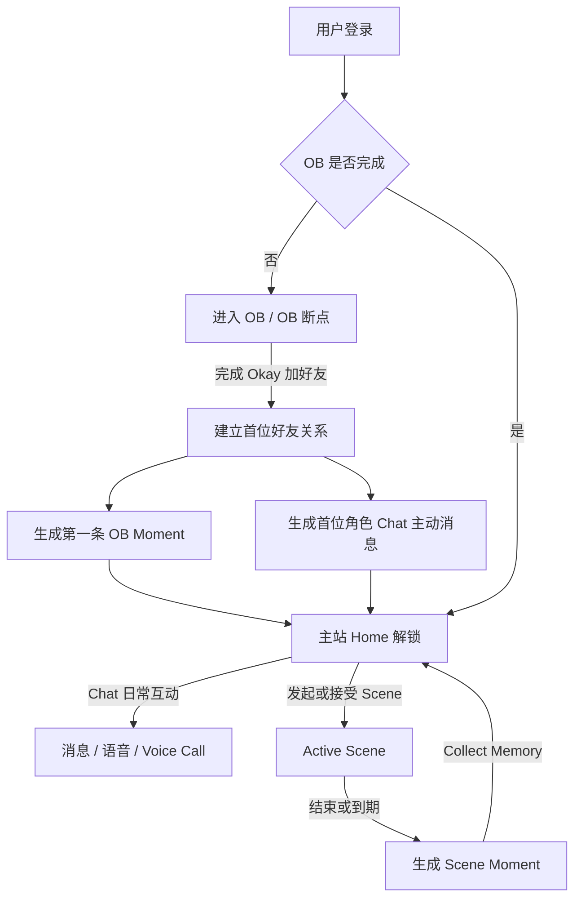

# Idol 102 后端业务 Story 拆解

**本文目的：**把 Idol 102 分散在 Login、OB、Chat、Scene、Home、Me 里的产品规则，拆成后端更容易理解和开发排期的业务 Story。

**本文不做：**不定义接口名、字段名、表结构、服务拆分、缓存方案、prompt 细节或具体技术实现。本文只讲清楚业务能力、状态流转、上下游关系、边界和验收结果。

**阅读方式：**后端可以把每个 Story 当成一个业务能力包来看。真正开发时，可以再按技术模块合并或拆分任务。

# 0\. 全局业务地图

Idol 102 的后端复杂度主要不在单个页面，而在状态之间的连续性：用户从登录进入 OB，OB 完成后解锁主站；Chat、Scene、Home 之间互相写入和读取关系事件；Me 和 Chat Settings 又会影响全局展示和语言规则。

## 0\.1 主业务链路

## 0\.2 Story 总览

|Story|业务能力|主要依赖|主要产物|
|---|---|---|---|
|Story 1|登录态与登录后路由|账号、OB 状态|Login / OB / Home 的正确路由结果|
|Story 2|OB 状态机与断点恢复|角色选择、OB 进度|可恢复的 OB 阶段状态|
|Story 3|OB 完成后的关系初始化|OB、好友、Home、Chat|首位好友、第一条 Moment、主动消息、主站解锁|
|Story 4|角色好友关系与 Discover Members|角色配置、好友关系|已添加角色列表、新角色开场白|
|Story 5|Chat 会话与普通消息|好友关系、消息状态|会话列表、消息流、未读、重试|
|Story 6|角色语音与 Voice Call|Chat、语言设置、AI 判断|语音消息、来电记录、回放|
|Story 7|同一时间只能有 1 个 Active Scene 邀请与创建|Chat、Scene 配置、好友关系|邀请卡片、Accept / Decline / Go Now、Scene 创建|
|Story 8|Active Scene 生命周期与互斥|Scene、Chat 锁定|唯一 Active Scene、恢复入口、到期规则|
|Story 9|Scene 结束与 Moment 生成|Scene 对话、Home|拍立得、Memory、Home 定位|
|Story 10|Home 故事线与 Memory Replay|Moment、角色关系|按角色和日期聚合的记忆视图|
|Story 11|用户资料、角色展示资料与语言|Me、Chat Settings|资料同步、Default Language 影响范围|
|Story 12|安全控制、反馈、举报、登出、注销|账号、Chat、Me|反馈、举报、登出、注销结果|

**后端阅读重点：**每个 Story 里出现的“系统需要支持”都是业务能力描述，不是字段清单。技术实现可以自行设计，但验收结果必须满足。

---

# Story 1：登录态与登录后路由

**Status:** draft

## Story

As a 用户，I want 打开 App 或登录成功后进入正确的位置，so that 我不会在未完成 OB 时误入主站，也不会在已完成 OB 后重复走新手流程。

## Context

Login 不只是账号认证。它还承担产品入口路由：无登录态进入 Login，有登录态后继续判断 OB 状态。OB 未完成必须进入 OB；OB 已完成默认进入 Home。

## Scope

- 登录态有效性判断。

- 15 天登录态有效期。

- Google、Apple、Email 三种登录方式的成功结果。

- 登录成功后的 OB 状态判断。

- 冷启动时 Login / OB / Home 的路由。

## Out of Scope

- 三方 SDK 接入细节。

- Email 验证码接口字段设计。

- Terms / Privacy 正文内容。

- Me 里的登出和注销流程。

## Business Rules

- 无登录态或登录态过期时，用户只能进入 Login。

- 登录态有效期为 15 天。

- 首次使用任一登录方式验证成功时，系统自动创建账号。

- 用户必须同意 Terms of Use / Privacy Policy 才能发起登录。

- 登录成功后不能直接进 Home，必须先判断 OB 状态。

- OB 未完成时进入 OB 或 OB 断点。

- OB 已完成时进入主站，默认落地 Home。

- 自动登录失败时回到 Login，不需要把失败暴露成强错误弹窗。

## Acceptance Criteria

1. Given 用户无登录态，When 打开 App，Then 展示 Login。

2. Given 用户登录态过期，When 打开 App，Then 展示 Login。

3. Given 用户登录态有效且 OB 未完成，When 打开 App，Then 进入 OB 断点或 OB 起点。

4. Given 用户登录态有效且 OB 已完成，When 打开 App，Then 默认进入 Home。

5. Given 用户登录成功，When OB 状态判断失败，Then 不能错误进入主站，应停留 loading / 重试 / 回到安全状态。

6. Given 用户未勾选协议，When 点击任一登录动作，Then 不发起认证。

7. Given Email 验证码登录成功，When 是新邮箱，Then 创建账号并继续判断 OB 状态。

## System Needs To Support

- 判断用户是否有有效登录态。

- 判断登录态是否过期。

- 判断用户 OB 状态。

- 返回或支持前端获得下一步应该去 Login、OB 还是 Home。

- 登录成功后保持同一账号的数据、好友、OB 进度和主站状态。

## Edge Cases

- 登录态本地存在但服务端状态不可用。

- 用户 App 使用中登录态失效。

- 同一用户重新登录后，需要恢复原账号的 OB 进度和数据。

- 三方授权取消不应被当成业务错误。

- Email 验证码发送成功后杀进程，不要求恢复未完成验证码流程。

---

# Story 2：OB 状态机与断点恢复

**Status:** draft

## Story

As a 新用户，I want 在 OB 中按固定剧情建立第一段关系，so that 我完成主站解锁前已经和首位角色发生过一段共同经历。

## Context

OB 是强制新手流程，但它不是教程，而是第一段关系建立。后端需要支持 OB 的阶段推进和断点恢复，尤其要保证用户不能跳过 OB，也不能因为 AI 或内容失败而卡死。

## Scope

- OB 阶段状态。

- 角色选择确认。

- 梦境小剧场进度。

- ERROR / Reload / 现实转场状态。

- 楼下偶遇实时对话轮次。

- 第 5 轮后的固定收束。

- Okay 加好友确认页的保留。

## Business Rules

- OB 必须完成，不能跳过。

- 用户确认首位角色后，不能返回重新选择。

- OB 没完成前，Home / Chat / Scene / Me 不开放。

- 梦境小剧场使用预设内容，不使用实时 AI。

- 梦境阶段共 5 轮，每轮固定 3 个选项。

- 楼下偶遇才使用实时文字对话。

- 楼下偶遇只允许 5 轮，用户 1 条消息 \+ 角色 1 次回复算 1 轮。

- 第 5 轮结束后必须进入固定收束“有事先离开\+加联系方式”，用户不能继续第 6 轮。

- Okay 按钮必须出现。

- 用户点击 Okay 且加好友成功后，OB 才算完成。

## OB State Model

|阶段|业务含义|恢复规则|
|---|---|---|
|未确认角色|用户还在选择首位角色。|回到选角页。|
|已确认角色，梦境未完成|首位角色已锁定，正在梦境剧情。|回到梦境小剧场起点，不恢复中间轮次。|
|ERROR|梦境已被打断，等待用户 Reload。|回到 ERROR 页。|
|现实转场后|梦境已结束，准备进入楼下偶遇。|回到楼下偶遇起点。|
|楼下偶遇进行中|用户正在和角色实时文字对话。|回到楼下偶遇起点，不保留中间聊天。|
|Okay 确认页|5 轮已完成，等待加好友确认。|回到 Okay 页面，按钮继续展示。|
|OB 已完成|首位好友已建立，主站已解锁。|进入 Home。|

## Acceptance Criteria

1. Given 用户未完成 OB，When 尝试进入主站，Then 被拦截并回到 OB。

2. Given 用户已确认角色，When 退出后回来，Then 不能重新选角色。

3. Given 用户在梦境第 3 轮退出，When 回来，Then 从梦境小剧场起点开始。

4. Given 用户已经进入 ERROR，When 回来，Then 仍停留 ERROR。

5. Given 用户在楼下偶遇第 4 轮退出，When 回来，Then 从楼下偶遇起点开始。

6. Given 楼下偶遇完成第 5 轮，When AI 回复异常，Then 流程仍进入收束，并展示 Okay 或兜底文案。

7. Given 用户在 Okay 页面退出，When 回来，Then 仍展示 Okay，不要求重走 5 轮。

## System Needs To Support

- 保存用户首位角色选择结果。

- 保存 OB 当前阶段。

- 保存或判断是否已经进入 ERROR。

- 保存是否已经到达 Okay 确认页。

- 控制 OB 是否完成。

- 保证 OB 完成动作具备幂等性，避免重复生成好友和 Moment。

## Backend Attention

OB 的流程推进不能交给 AI 判断。AI 可以生成楼下偶遇回复，但不能决定是否收束、是否显示 Okay、是否加好友、是否 OB 完成。

---

# Story 3：OB 完成后的关系初始化

**Status:** draft

## Story

As a 完成 OB 的用户，I want 立刻在 Home 和 Chat 看到关系延续信号，so that 我感觉流程结束后关系真的开始了。

## Context

OB 完成不是单一状态置位。它会同时影响好友关系、主站开放、Home 记忆、Chat 未读消息和默认落地页。如果这些副作用漏掉任何一个，用户会感觉 OB 和主站断裂。

## Business Rules

- 用户点击 Okay 并加好友成功后，OB 才算完成。

- 首位角色成为已添加好友。

- 主站 Home / Chat / Scene / Me 解锁。

- 默认落地 Home，不默认落地 Chat。

- Home 必须出现第一张 OB Moment。

- Home 当前角色为首位角色。

- Home 展示 Day 1 since you met。

- Chat 必须出现首位角色会话。

- Chat 必须出现角色主动消息和未读提示。

## Required Side Effects

|副作用|业务要求|
|---|---|
|好友关系|首位角色被加入用户已添加角色列表。|
|OB 状态|用户 OB 标记为完成，后续不再强制进入 OB。|
|Home Moment|生成来自楼下偶遇的第一张 Moment，挂到首位角色故事线。|
|Home 默认角色|当前角色为首位角色，并显示 Day 1。|
|Chat 会话|首位角色出现在 Chat 列表。|
|Chat 主动消息|插入角色主动开场消息，并形成未读提示。|
|主站开放|Home / Chat / Scene / Me 均可进入。|

## Acceptance Criteria

1. Given 用户点击 Okay 且加好友成功，When OB 完成，Then 默认进入 Home。

2. Given OB 完成，When 打开 Home，Then 能看到首位角色和第一张 Moment。

3. Given OB 完成当天，When 查看 Home，Then 相识天数显示 Day 1 since you met。

4. Given OB 完成，When 打开 Chat，Then 首位角色会话存在且有未读主动消息。

5. Given OB 完成动作因网络重试被触发多次，Then 不应重复添加好友、重复生成 OB Moment 或重复插入主动消息。

6. Given 第一张 Moment 总结还没生成，Then Home 和拍立得展示 Memory is being written\.\.\.，不能空白。

## System Needs To Support

- 把 OB 完成动作作为一个业务事务或可恢复编排。

- 建立角色好友关系。

- 生成 OB Moment。

- 插入 Chat 主动消息。

- 设置或返回主站开放状态。

- 支持重复请求下的幂等处理。

---

# Story 4：角色好友关系与 Discover Members

**Status:** draft

## Story

As a 已完成 OB 的用户，I want 添加更多角色，so that 我的关系网络可以从首位角色扩展到更多成员。

## Context

好友关系是 Chat、Scene、Home 的共同基础。只有已添加角色能进入 Chat，会出现在 Home 多角色切换中，也能被邀请进入 Scene。

## Scope

- 已添加角色列表。

- 未添加角色列表。

- Discover Members 加好友。

- 新角色加入后的 Chat / Home / Scene 同步。

## Business Rules

- Discover Members 只展示尚未添加的角色。

- 已添加角色不再出现在 Discover Members。

- 全部添加后展示 You've added everyone。

- 用户点击 Add Friend 成功后，新角色成为已添加角色。

- 新角色必须出现在 Chat 列表，并带未读开场白。

- 新角色必须可以在 Home 中切换。

- 新角色必须可以在 Scene 选角弹窗中被邀请。

- 重复点击或重复请求只能成功添加一次。

## Acceptance Criteria

1. Given 用户已添加角色 A，When 打开 Discover Members，Then 不展示角色 A。

2. Given 用户点击角色 B 的 Add Friend，When 添加成功，Then 角色 B 出现在 Chat 列表。

3. Given 角色 B 添加成功，When 打开 Chat，Then 角色 B 会话带未读开场白。

4. Given 角色 B 添加成功，When 打开 Home，Then 用户可以切换到角色 B。

5. Given 角色 B 添加成功，When 发起 Scene，Then 角色 B 出现在选角弹窗。

6. Given 用户重复点击 Add Friend，Then 系统只建立一次好友关系。

7. Given 所有角色都已添加，When 打开 Discover Members，Then 展示空状态。

## System Needs To Support

- 角色全集。

- 用户已添加角色关系。

- 按用户过滤未添加角色。

- 角色加入后的相识日期。

- 角色加入后的默认会话和开场白。

- 好友关系的幂等创建。

---

# Story 5：Chat 会话与普通消息

**Status:** draft

## Story

As a 已添加角色的用户，I want 和角色持续聊天并看到清晰的消息状态，so that 这段关系像真实对话一样连续。

## Context

Chat 是关系延续入口，不是普通客服列表。它需要承接 OB 主动消息、加好友开场白、Scene 邀请、Scene 进行中锁定、未读和消息重试。

## Scope

- Chat 列表。

- 单角色 Chat 对话页。

- 文本、图片、文本 \+ 图片消息。

- 角色普通文本回复。

- 未读、已读、输入中状态。

- 发送失败和 AI 回复失败重试。

- 清空聊天记录。

## Business Rules

- 用户只能主动发送文本、图片、文本 \+ 图片。

- 用户不能主动发送语音。

- 用户不能主动拨打电话。

- 用户每次只能发送 1 条消息，必须等角色本轮回复完成后才能发送下一条。

- 图片 \+ 文本组合算 1 条消息。

- 角色回复前展示输入中状态。

- 角色文本回复语言跟随用户 Default Language。

- 用户进入某角色对话页后，该角色未读数清零。

- Chat 列表按最后消息时间倒序。

- 清空聊天记录只清空消息显示和该角色聊天内容，不删除好友关系、Home Moment、Scene 记录或角色设置。

## Message Types

|类型|发送方|用户可主动触发|列表预览|
|---|---|---|---|
|文本|用户 / 角色|可以|展示实际内容，超长截断。|
|图片|用户|可以|Photo|
|语音|角色|不可以|Voice Message|
|电话记录|角色|不可以|Voice Call|
|Scene 邀请卡片|用户 / 角色|通过 Scene 流程触发|Scene Invitation|
|Scene 进行中|系统状态|不适用|\[Scene in progress\]|

## Acceptance Criteria

1. Given OB 完成，When 打开 Chat 列表，Then 至少有首位角色会话。

2. Given 用户发送一条消息，When 角色未回复完成，Then 输入区不可继续发送。

3. Given 用户发送图片 \+ 文本，Then 系统按 1 条用户消息处理。

4. Given 用户消息发送失败，Then 用户可看到失败状态并重试。

5. Given 角色回复失败或超时，Then 用户可重试，不应卡死会话。

6. Given 某角色有未读，When 用户进入该角色 Chat，Then 该角色未读清零。

7. Given 用户清空某角色聊天记录，Then 好友关系、Home Moment、角色设置均不受影响。

## System Needs To Support

- 按用户和角色组织会话。

- 维护最后消息、最后消息时间和未读数。

- 维护消息发送状态和重试能力。

- 支持清空某角色聊天记录，但保留好友关系和记忆。

- 识别当前角色是否因 Active Scene 被锁定。

---

# Story 6：角色语音与 Voice Call

**Status:** draft

## Story

As a Chat 用户，I want 在合适的情绪节点收到角色语音或 App 内来电，so that 关系体验更有陪伴感和情绪峰值。

## Context

语音和 Voice Call 都只能由角色侧触发。它们不是用户主动操作能力，也不是真实电话。后端需要保证触发判断、内容生成、语言规则和记录回放一致。

## Business Rules

- 用户不能主动发送语音。

- 用户不能主动拨打电话。

- 角色语音由角色侧触发，通常来自情绪强度或后端判断。

- Voice Call 由角色侧触发，可能来自强关键词或高情绪强度。

- 语音和电话的声音始终是角色母语。

- 语音文本内容和电话字幕跟随用户 Default Language。

- 声音和文本表达的是同一段内容，只是语言不同。

- Scene 进行中、OB、Scene 对话内不触发普通 Chat 语音或电话。

- 同一时间只允许 1 个角色来电。

## Voice Message Criteria

1. Given 后端判断适合发送语音，When 角色回复，Then Chat 中出现角色语音消息。

2. Given 语音消息存在，Then 必须有可播放音频、时长和文本内容。

3. Given 音频加载失败但文本可用，Then 可降级展示文本或允许重试。

4. Given 文本暂未准备好，Then 可展示 Translating\.\.\. 之类占位。

## Voice Call Criteria

1. Given 角色电话被触发且用户仍在该角色 Chat，When 电话开始，Then 展示全屏 App 内来电页。

2. Given 用户不在该角色 Chat，When 电话被触发，Then 不弹来电页，直接生成 Call Ended 记录。

3. Given 来电 30 秒内用户接听，Then 进入通话播放页。

4. Given 用户拒接、超时、离开页面、接听后挂断或完整听完，Then Chat 中都生成 Call Ended 记录。

5. Given 电话记录存在，When 用户点击，Then 可回放完整电话内容。

6. Given 用户当时没有接听，When 点击电话记录，Then 仍可回放完整电话内容。

## System Needs To Support

- 判断角色是否触发语音或电话。

- 生成或保存语音音频、语音文本、电话音频、电话字幕。

- 区分电话响铃、接听、拒接、超时、挂断、播放完成、回放。

- 只要电话被触发，就保留可回放电话记录。

- 根据用户当前页面状态决定是否弹全屏来电页。

- 保证 Default Language 只影响文本和字幕，不影响声音语言。

## Important Non\-Goals

- 不是系统电话。

- 不拨打用户手机号。

- 不进入 iOS / Android 原生电话 UI。

- 不允许用户主动呼叫角色。

---

# Story 7：Scene 邀请与创建

**Status:** draft

## Story

As a 已添加角色的用户，I want 通过地点和事件邀请角色进入 Scene，or 接受角色发来的 Scene 邀请，so that 我们能从聊天进入一段共同经历。

## Context

Scene 的创建有两条路径：用户主动发起，或角色 Trigger 发起。两条路径最终都要创建 Active Scene，但前置消息、按钮和过期规则不同。

## Scene Base Rules

- Scene 必须在 OB 完成后才开放。

- Scene 只允许邀请已添加角色。

- 1\.0 开放 Company、Practice Room、Cafe、Mall、Park。

- Apartment 锁定，点击只提示 Not open yet。

- Scene 的核心是地点 \+ 事件 \+ 角色 \+ 对话 \+ 拍立得。

- 同一时间只能有 1 个 Active Scene。

## Path A：用户主动发起

1. 用户在地图选择地点。

2. 用户在地点二级页选择事件。

3. 用户选择已添加角色。

4. App 跳转到该角色 Chat。

5. Chat 进入邀请待发送态，展示地点 / 事件预览条。

6. 用户发送邀请。

7. Chat 插入 Scene 邀请卡片。

8. 角色接受邀请。

9. 角色回复下方出现 Go Now。

10. 用户 24 小时内点击 Go Now 后创建 Scene。

## Path B：角色 Trigger 发起

1. Trigger 判断适合发起 Scene。

2. 角色在 Chat 中发送邀请消息或邀请语音。

3. Chat 中出现 Scene 邀请卡片。

4. 卡片下方展示 Accept / Decline。

5. 用户点击 Accept 后创建 Scene。

6. 用户点击 Decline 后不创建 Scene。

7. 24 小时未操作则邀请过期，不创建 Scene。

## Acceptance Criteria

1. Given 用户未完成 OB，When 尝试进入 Scene，Then 不允许进入。

2. Given 用户点击 Apartment，Then 不创建 Scene，只提示 Not open yet。

3. Given 用户从某角色 Chat 发起 Scene，When 打开选角弹窗，Then 该角色排在优先位置。

4. Given 用户发送 Scene 邀请，Then Chat 中插入邀请卡片。

5. Given Path A 邀请发出，Then 角色默认接受并出现 Go Now。

6. Given Go Now 超过 24 小时未点击，Then 邀请过期，不能创建 Scene。

7. Given Trigger 邀请出现，When 用户点击 Decline，Then 不创建 Scene，按钮消失。

8. Given 已有 Active Scene，When 用户尝试创建新的 Scene，Then 不能创建，应进入拦截逻辑。

## System Needs To Support

- 地点和事件配置。

- 已添加角色筛选。

- 邀请待发送态。

- Scene 邀请卡片状态：待发送、已发送、已接受、已拒绝、已过期。

- Go Now 24 小时有效期。

- Trigger 发起邀请的业务入口。

- 创建 Scene 前检查是否已有 Active Scene。

---

# Story 8：Active Scene 生命周期与互斥

**Status:** draft

## Story

As a 正在 Scene 中的用户，I want 系统记住当前共同经历并阻止我开启另一个 Scene，so that 当前经历不会和其他角色、其他地点混乱。

## Context

Active Scene 是 Scene 系统的关键状态。它会影响 Scene 地图、Chat 列表、当前角色 Chat 输入框、Trigger 是否还能发起新邀请，以及 App 退出后的恢复。

## Business Rules

- 同一时间只能有 1 个 Active Scene。

- Active Scene 存在时，用户不能发起其他 Scene。

- Active Scene 存在时，Trigger 不能发起新的 Scene 邀请。

- Active Scene 只锁当前角色普通 Chat。

- 其他角色 Chat 不受影响。

- Scene 有 24 小时有效期。

- 用户可以主动离开 Scene，不需要二次确认。

- App 退出后回来，默认回到当前角色 Chat，并展示 Scene 进行中条。

- 用户从 Chat、地图、拦截弹窗恢复进入 Scene 时，都要播放进入过渡动画。

## Active Scene Visibility

|位置|表现|
|---|---|
|Chat 列表|该角色会话预览显示 \[Scene in progress\]。|
|当前角色 Chat|顶部展示 Scene 进行中条，输入框锁定。|
|其他角色 Chat|正常聊天，不被锁定。|
|Scene 地图|Active Scene 所在地点展示角色头像和提示角标。|
|尝试新 Scene|出现进行中拦截弹窗。|

## Interception Rules

- 当已有 Active Scene 时，用户点击其他地点、其他事件或发起新的 Scene，需要拦截。

- 弹窗文案说明当前正在和哪个角色、在哪个地点。

- 用户选择 Back to Scene，则恢复当前 Scene。

- 用户选择 Leave Scene，则结束当前 Scene，生成 Moment，然后允许继续新的 Scene 操作。

- 关闭弹窗则什么都不变。

## Acceptance Criteria

1. Given 已有 Active Scene，When 用户尝试发起新 Scene，Then 不创建新 Scene。

2. Given Active Scene 属于角色 A，When 用户进入角色 A Chat，Then 输入框锁定。

3. Given Active Scene 属于角色 A，When 用户进入角色 B Chat，Then 角色 B Chat 可正常聊天。

4. Given 用户点击进行中条，Then 播放过渡动画并恢复进入 Scene。

5. Given 用户在拦截弹窗点击 Leave Scene，Then 当前 Scene 结束并生成 Moment。

6. Given Active Scene 到期且用户不在 Scene 内，Then 系统自动结束并生成 Moment。

7. Given Active Scene 到期但用户正在 Scene 内，Then 不硬切打断，等待自然收尾或离场钩子结束。

## System Needs To Support

- 查询用户当前是否有 Active Scene。

- 记录 Active Scene 的角色、地点、事件、开始时间和到期时间。

- 支持 Active Scene 恢复入口。

- 支持当前角色 Chat 锁定状态。

- 支持 Active Scene 到期处理。

- 支持主动离开和拦截弹窗离开。

---

# Story 9：Scene 结束与 Moment 生成

**Status:** draft

## Story

As a 完成 Scene 的用户，I want 这段共同经历被生成一张拍立得并收进 Home，so that 我们的关系有可回看的记忆。

## Context

Scene 的价值不是聊完就结束，而是把这段经历沉淀成 Home 中的 Moment。所有 Scene 结束方式都必须生成 Moment，包括主动离开、拦截离开、24 小时到期和自然收尾。

## End Conditions

|结束方式|是否生成 Moment|说明|
|---|---|---|
|用户主动离开|是|不需要二次确认。|
|拦截弹窗 Leave Scene|是|结束当前 Scene 后允许继续新操作。|
|24 小时到期且用户不在 Scene 内|是|系统自动结束。|
|24 小时到期但用户正在 Scene 内|是|等待自然收尾或离场钩子。|

## Moment Content

- 场景图。

- 总结标题。

- 总结正文。

- 真实日期。

- 地点。

- 对应 Scene 聊天快照。

- 所属角色。

## Business Rules

- Moment 生成不能因为 AI 总结未完成而失败。

- 总结未完成时展示 Memory is being written\.\.\.。

- 用户点击 Collect Memory 后进入 Home。

- Home 需要切换到该 Moment 所属角色。

- Home 需要定位到该 Moment 所属日期。

- 如果当天已有其他 Moment，新 Moment 合并进同一日期卡。

## Acceptance Criteria

1. Given 用户主动离开 Scene，Then 生成 Moment。

2. Given Scene 24 小时到期，Then 最终生成 Moment。

3. Given AI 总结未完成，When 展示拍立得，Then 正文区域显示 Memory is being written\.\.\.。

4. Given 用户点击 Collect Memory，Then 进入 Home 并定位到对应角色和日期。

5. Given 该日期已有 Moment，When 新 Moment 生成，Then 不新增日期卡，只更新该日期 Moment 数量。

6. Given Scene 结束请求重复触发，Then 不重复生成同一 Scene 的 Moment。

## System Needs To Support

- Scene 到 Moment 的一次性生成。

- Moment 总结异步生成状态。

- Moment 与角色、日期、地点、Scene 快照的关联。

- Collect Memory 回 Home 的定位信息。

- Scene 结束幂等。

---

# Story 10：Home 故事线与 Memory Replay

**Status:** draft

## Story

As a 已经产生 Moment 的用户，I want 在 Home 按角色和日期查看共同经历，so that 我能回看我们什么时候发生过什么。

## Context

Home 是关系沉淀页。它不展示没有意义的自然日，而是只展示有 Moment 的日期。点击日期后看到该日期下的 Moment 拍立得，并可进入只读 Memory Replay。

## Business Rules

- Home 必须在 OB 完成后才开放。

- OB 完成后 Home 至少有首位角色和第一条 OB Moment。

- Home 当前角色必须是已添加角色。

- 相识天数按用户本地时区计算。

- 已添加多个角色时，Home 支持按加好友顺序切换。

- 切换角色后，海报、昵称、相识天数、故事线都切换为该角色数据。

- 故事线只展示有 Moment 的日期。

- 没有 Moment 的日期不占位。

- 一天多个 Moment 合并到同一天故事线日期卡。

- Memory Replay 只读，不可发送、不可修改消息。

- Moment Edit 只影响展示层，不影响角色记忆和原始 Scene 记录。

## Home Read Model

|对象|展示规则|
|---|---|
|当前角色|来自已添加角色，默认首位角色或用户当前切换角色。|
|相识天数|从该角色被添加或 OB 建立关系时开始，按本地时区 00:00 增加。|
|故事线日期卡|只展示有 Moment 的日期，按发生日期从早到晚。|
|日期卡封面|默认取该日期第一个 Moment 的场景图。|
|Moment 拍立得|展示场景图、标题、正文、日期、地点。|
|Memory Replay|展示原始聊天快照，只读。|

## Acceptance Criteria

1. Given OB 完成，When 打开 Home，Then 展示首位角色和第一张 OB Moment。

2. Given 当前角色没有任何 Moment，Then 可展示 No memory yet，但不能展示空白日期卡。

3. Given 某角色同一天有多个 Moment，When 查看故事线，Then 只出现一张日期卡，数量显示 N moments。

4. Given 用户切换角色，Then Home 的海报、昵称、天数、故事线同步切换。

5. Given 用户进入 Memory Replay，Then 不显示输入框，不允许发送消息。

6. Given 用户编辑 Moment 正文，Then 只改变拍立得展示正文，不改变原始聊天快照。

## System Needs To Support

- 按角色查询 Moment 日期聚合。

- 按日期查询 Moment 列表。

- Moment 的展示图、标题、正文、日期、地点。

- Moment 原始聊天快照。

- 用户对 Moment 展示图和正文的编辑结果。

- 用户当前角色或 Home 切换状态。

---

# Story 11：用户资料、角色展示资料与语言

**Status:** draft

## Story

As a 用户，I want 分别管理“我自己”和“角色在我这里的展示方式”，and 设置默认语言，so that 全 App 的资料和语言表现一致。

## Context

Me 修改的是用户资料，Chat Settings 修改的是角色资料。两者不能混淆。Default Language 则影响 App 文案、角色文本、语音文本和电话字幕，但不影响角色声音语言。

## User Profile Rules

|资料|业务规则|影响范围|
|---|---|---|
|用户背景图|可修改和恢复默认。|只在 Me 页面展示。|
|用户头像|可修改和恢复默认。|Me 页面和 Chat 用户消息气泡。|
|用户昵称|默认 You，不能为空。|只影响 UI 展示，不决定角色如何称呼用户。|
|UID|只读，必须展示。|Me 页面。|
|邮箱|只读；拿不到时隐藏。|Me 页面和反馈邮箱预填。|

## Character Display Rules

|设置项|影响范围|
|---|---|
|角色昵称|Chat 列表、Chat 对话页、Home、Scene 等展示该角色昵称的位置。|
|角色头像|Chat 列表、Chat 对话页、Scene 等展示该角色头像的位置。|
|角色聊天背景|仅该角色 Chat 对话页。|
|角色 Home 海报|Home 中该角色海报；与 Home 点击海报修改同步。|

## Default Language Rules

|对象|是否跟随 Default Language|
|---|---|
|App 系统文案|是|
|角色文本回复|是|
|角色语音消息下方文本|是|
|Voice Call 字幕|是|
|Voice Call 回放字幕|是|
|角色语音声音|否，始终为角色母语。|
|Voice Call 声音|否，始终为角色母语。|
|用户输入语言|否，用户可用任意语言。|

## Acceptance Criteria

1. Given 用户修改头像，When 打开 Chat，Then 用户消息气泡旁头像同步更新。

2. Given 用户修改昵称，Then 只影响 UI 展示，不改变角色对用户的称呼逻辑。

3. Given Chat Settings 修改角色昵称，Then Home / Chat / Scene 中该角色昵称同步更新。

4. Given Home 修改角色 Home 海报，Then Chat Settings 中看到的是同一个结果。

5. Given 用户修改 Default Language，Then 新产生的角色文本回复跟随新语言。

6. Given 用户修改 Default Language，Then 角色语音和电话声音仍保持角色母语。

7. Given 邮箱拿不到，Then Me 页面不展示空白邮箱位。

## System Needs To Support

- 用户资料和角色展示资料分开存储或分开解释。

- 用户头像变更后影响 Chat 用户气泡。

- 角色昵称、头像、Home 海报的全局展示同步。

- Default Language 当前值。

- 历史语音 / 电话文本可按当前语言重新展示的能力或降级策略。

---

# Story 12：安全控制、反馈、举报、登出、注销

**Status:** draft

## Story

As a 用户，I want 能反馈问题、举报内容、登出或注销账号，so that 我对账号和安全有基本控制权。

## Context

这些功能不是主叙事链路，但会影响用户信任。它们需要稳定、可恢复、不能误删数据，也不能在失败时给用户造成错觉。

## Feedback Rules

- 反馈类型必选。

- 反馈原因必填。

- 邮箱必填。

- 如果系统已拿到用户邮箱，可以预填。

- 邮箱格式明显错误时提示用户修改。

- 提交失败时保留用户已填写内容。

## Report Rules

- 举报入口来自 Chat Settings 的 Report Character 或长按角色消息后的 Report。

- 举报原因必选。

- 提交成功后提示 Report submitted。

- 提交失败时允许再次提交。

## Log Out Rules

- Log Out 必须二次确认。

- 确认后清除本地登录态并返回 Login。

- Log Out 不删除用户数据。

- 下次登录后应恢复原账号数据。

## Delete Account Rules

- Delete Account 必须二次确认。

- 弹窗必须明确说明不可恢复。

- 确认后账号进入注销处理。

- 注销成功后清除登录态并返回 Login。

- 注销失败时必须提示失败，并保留登录状态，不能静默登出。

- 具体数据清理、保留周期和合规策略由开发按账号注销规范实现。

## Acceptance Criteria

1. Given 反馈缺少类型、原因或邮箱，When 用户提交，Then 不能提交。

2. Given 举报未选择原因，When 用户提交，Then 不能提交。

3. Given 用户点击 Log Out，Then 先出现二次确认。

4. Given 用户确认 Log Out，Then 回到 Login，用户数据保留。

5. Given 用户点击 Delete Account，Then 先出现带不可恢复说明的二次确认。

6. Given 注销成功，Then 用户回到 Login。

7. Given 注销失败，Then 用户仍保持登录状态，并看到失败提示。

## System Needs To Support

- 反馈提交结果。

- 举报提交结果。

- 登出结果。

- 账号注销处理状态。

- 注销失败时的安全回滚或保留登录状态。

---

# 13\. 跨 Story 不可破坏规则

|编号|规则|关联 Story|
|---|---|---|
|R1|OB 未完成前，Home / Chat / Scene / Me 不开放。|1, 2, 3|
|R2|登录成功后必须判断 OB 状态，不能直接进入 Home。|1|
|R3|OB 完成后必须默认落地 Home。|3, 10|
|R4|OB 完成后必须同时有首位好友、第一张 Moment、Chat 主动未读消息。|3, 5, 10|
|R5|Okay 必须出现，不能依赖 AI 文案。|2, 3|
|R6|用户不能主动发语音或主动拨打角色电话。|5, 6|
|R7|角色声音始终为角色母语，文本和字幕跟随 Default Language。|6, 11|
|R8|同一时间只能有 1 个 Active Scene。|7, 8, 9|
|R9|Active Scene 只锁当前角色 Chat，不能锁其他角色 Chat。|5, 8|
|R10|Scene 所有结束方式都必须生成 Moment。|8, 9, 10|
|R11|Home 故事线只展示有 Moment 的日期。|9, 10|
|R12|Memory Replay 只读，不允许继续聊天。|10|
|R13|Moment Edit 只影响展示层，不影响原始记忆。|10|
|R14|Me 管用户资料，Chat Settings 管角色展示资料，不能混淆。|11|
|R15|Delete Account 失败后不能静默登出。|12|

---

# 14\. 建议开发顺序

以下顺序不是强制技术排期，而是从业务依赖关系看更顺的拆法。

1. Story 1：登录态与登录后路由。

2. Story 2：OB 状态机与断点恢复。

3. Story 3：OB 完成后的关系初始化。

4. Story 4：角色好友关系与 Discover Members。

5. Story 5：Chat 会话与普通消息。

6. Story 7：Scene 邀请与创建。

7. Story 8：Active Scene 生命周期与互斥。

8. Story 9：Scene 结束与 Moment 生成。

9. Story 10：Home 故事线与 Memory Replay。

10. Story 6：角色语音与 Voice Call。

11. Story 11：用户资料、角色展示资料与语言。

12. Story 12：安全控制、反馈、举报、登出、注销。

**最小可用闭环建议：**如果要先做 1\.0 核心闭环，优先打通 Story 1 → Story 2 → Story 3 → Story 5 的最小能力：登录后进入 OB、完成 OB、生成首位好友、Home 有第一张 Moment、Chat 有主动消息。Scene 和更复杂的语音 / 电话可以在这个闭环稳定后继续拆。

> (注：内容由 AI 生成，请谨慎参考）
