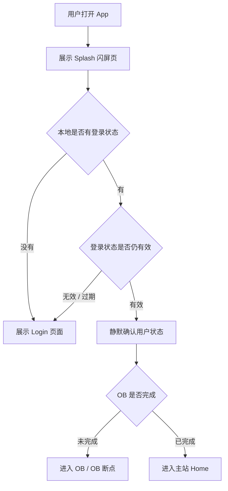
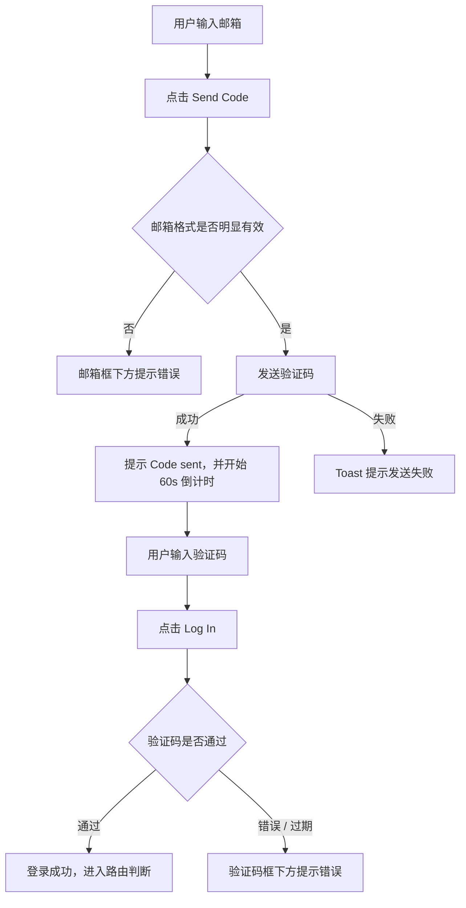

# Login 模块 PRD（产品功能版）

> 本文说明 Idol 102 登录模块的用户故事、产品意图、页面功能、交互逻辑、边界处理和验收标准。  
> 本文不定义接口名称、字段名称、数据表结构或具体技术实现方式，这些由开发根据业务需求自行设计。

## 1. 用户故事

作为一个第一次打开 Idol 102 的用户，  
我希望能用 Google、Apple 或 Email 快速进入 App，  
这样我不需要理解复杂注册流程，就可以开始选择角色和进入 OB。

作为一个已经登录过的用户，  
我希望在登录状态有效时自动进入上次应该进入的位置，  
这样我不会每次打开 App 都被要求重新登录。

作为一个需要安全感的用户，  
我希望在登录前能看到并点击 Terms of Use 和 Privacy Policy，  
这样我知道继续使用前自己同意了什么。

## 2. 产品意图

Login 是用户进入 Idol 102 的第一道门。

它的目标不是解释产品功能，而是完成三件事：

1. 让新用户完成账号认证。
2. 让老用户在登录态有效时跳过登录。
3. 根据用户 OB 状态，把用户送到正确页面。

登录页需要保持沉浸感和低打扰。用户看到的是“进入 Idol 102 的入口”，不是一个复杂账号中心。

## 3. 模块范围

Login 模块包含：

1. App 冷启动登录态判断
2. Splash 闪屏页
3. 开屏 / 登录主页
4. Google 登录
5. Apple 登录
6. Email 登录二级页
7. Terms of Use / Privacy Policy 同意
8. 登录成功后的路由
9. 登录失败、取消、过期等边界状态

不包含：

- OB 内部流程，详见 OB 模块 PRD。
- Me 页的登出、注销和账号资料管理，详见 Me 模块 PRD。
- Terms of Use / Privacy Policy 页面正文内容，只定义入口和打开方式。

## 4. 核心规则

以下规则不能改：

1. 用户可使用 Google、Apple、Email 三种方式登录。
2. 没有单独注册页。
3. 首次使用任一登录方式验证成功时，系统自动创建账号。
4. 用户必须勾选 Terms of Use / Privacy Policy 同意项，才能发起登录动作。
5. 未勾选时，不允许拉起三方授权、不允许进入 Email 登录页、不允许提交 Email 验证码登录。
6. 已登录且登录态有效的用户，冷启动时跳过登录页。
7. 登录态有效期为 15 天。
8. 登录成功后，必须根据 OB 状态路由。
9. OB 未完成时进入 OB。
10. OB 已完成时进入主站，默认落地 Home。
11. 登录页不展示 Home / Chat / Scene / Me 底部导航。
12. 退出登录由 Me 模块触发，退出后回到 Login。
13. Splash 闪屏页不展示登录按钮，也不展示 Terms / Privacy 协议勾选区。
14. Splash 只用于品牌露出和冷启动等待，不承载用户操作。

## 5. 冷启动与自动登录

### 5.1 页面目的

用户打开 App 后，系统先判断是否已有有效登录态。

这个判断过程展示 Splash 闪屏页，不展示完整 Login 页面。

如果用户已经登录且登录态仍有效，不应先闪一下登录按钮再跳转。用户应该感觉 App 是自然进入的。

### 5.2 冷启动流程



### 5.3 自动登录规则

- 登录态有效期为 15 天。
- 有效期内打开 App，应自动进入后续页面。
- 登录态过期后，打开 App 展示 Login 页面。
- 自动登录判断期间只展示 Splash，不展示登录按钮闪现。
- 自动登录失败时，直接回到 Login 页面，不需要弹错误弹窗。
- 重新登录后，如果是同一个账号，应恢复该账号已有数据和 OB 进度。

## 6. Splash 闪屏页

### 6.1 页面目的

Splash 是 App 冷启动时的过渡页。

它负责让用户看到 Idol 102 的品牌氛围，同时给系统完成登录态判断和 OB 状态判断的时间。

Splash 不是登录页，不允许用户在这里选择登录方式。

### 6.2 页面结构

Splash 页面包含：

- 背景图或氛围背景
- Idol 102 品牌展示
- 主标题或短氛围文案
- 轻量 loading 状态

Splash 页面不包含：

- Google 登录按钮
- Apple 登录按钮
- Email 登录按钮
- Terms of Use / Privacy Policy 勾选框
- Terms of Use / Privacy Policy 说明文案
- Home / Chat / Scene / Me 底部导航

### 6.3 视觉要求

Splash 可以沿用登录主页的视觉底子。

区别是：

- Splash 只保留品牌和氛围。
- Login 才展示登录按钮和协议区域。

Splash 的视觉应该是安静、沉浸、轻量的，不要出现大量功能说明。

### 6.4 出现时机

以下情况展示 Splash：

- App 冷启动
- 系统正在判断登录态
- 系统正在判断 OB 状态
- 登录成功后短暂路由等待，如需要

### 6.5 跳转规则

| 判断结果 | Splash 后进入 |
| --- | --- |
| 无登录态 | Login 页面 |
| 登录态过期 | Login 页面 |
| 登录态有效，OB 未完成 | OB 页面 / OB 断点 |
| 登录态有效，OB 已完成 | Home 页面 |

### 6.6 边界规则

- Splash 不应停留过久。
- 如果判断失败，可以回到 Login 页面或展示轻量重试提示。
- Splash 期间不允许用户点击登录动作，因为页面上没有登录按钮。
- Splash 期间不应该闪现协议区。
- Splash 到 Login 的切换可以使用淡入淡出，不要突兀跳变。

## 7. 开屏 / 登录主页

### 7.1 页面目的

让用户选择登录方式，并在视觉上建立 Idol 102 的第一印象。

页面不做长篇产品介绍，不做功能卖点列表，不做营销式落地页。

### 7.2 页面结构

登录主页包含：

- 背景图或氛围背景
- Idol 102 品牌展示
- 主标题
- 副标题
- `Continue with Google`
- `Continue with Apple`
- `Continue with Email`
- Terms of Use / Privacy Policy 同意项

### 7.3 建议文案

| 元素 | 文案 |
| --- | --- |
| 品牌名 | `Idol 102` |
| 主标题 | `CONNECTING BEYOND BOUNDARIES` |
| 副标题 | `A DIFFERENT KIND OF CLOSENESS` |
| Google 按钮 | `Continue with Google` |
| Apple 按钮 | `Continue with Apple` |
| Email 按钮 | `Continue with Email` |
| 条款同意 | `By continuing, you agree to Idol 102's Terms of Use and Privacy Policy.` |
| 未勾选提示 | `Please agree to the Terms of Use and Privacy Policy to continue.` |

如果后续要做多语言，文案跟随用户系统语言或产品默认语言处理。

### 7.4 视觉和布局要求

- 登录主页以手机端为基准。
- 背景应该是沉浸式深色氛围，可以使用星空、深夜后台、暗紫黑或玫瑰灯感。
- 品牌区位于页面中上部。
- 登录按钮区域位于页面下部。
- 三个登录按钮纵向排列，视觉权重一致。
- Google / Apple 按钮需要带对应品牌 icon。
- Email 按钮需要与三方登录按钮同级，不要做成弱入口。
- 底部需要预留系统安全区，避免按钮贴到 Home Indicator。
- 条款同意项放在登录按钮下方，文字可读，不要过小。

## 8. 登录主页交互

### 8.1 Google 登录

用户点击 `Continue with Google` 后：

1. 如果未勾选条款，先拦截并提示。
2. 如果已勾选，拉起 Google 授权。
3. 授权成功后进入登录处理。
4. 登录成功后进入路由判断。

用户取消 Google 授权时：

- 回到 Login 页面。
- 不弹错误弹窗。
- 按钮恢复可点击。

授权失败或网络失败时：

- Toast 提示：`Sign-in failed. Please try again.`
- 按钮恢复可点击。

### 8.2 Apple 登录

用户点击 `Continue with Apple` 后：

1. 如果未勾选条款，先拦截并提示。
2. 如果已勾选，拉起 Apple 授权。
3. 授权成功后进入登录处理。
4. 登录成功后进入路由判断。

用户取消 Apple 授权时：

- 回到 Login 页面。
- 不弹错误弹窗。
- 按钮恢复可点击。

授权失败或网络失败时：

- Toast 提示：`Sign-in failed. Please try again.`
- 按钮恢复可点击。

### 8.3 Email 入口

用户点击 `Continue with Email` 后：

1. 如果未勾选条款，先拦截并提示。
2. 如果已勾选，进入 Email 登录二级页。

未勾选时不进入 Email 登录二级页。

## 9. Terms of Use / Privacy Policy 同意项

### 9.1 展示规则

同意项需要同时出现在：

- 登录主页
- Email 登录二级页

默认未勾选。

### 9.2 交互规则

- 用户点击 checkbox，可以切换勾选状态。
- 用户点击 `Terms of Use`，打开内嵌 WebView。
- 用户点击 `Privacy Policy`，打开内嵌 WebView。
- 查看条款不要求先勾选。
- 未勾选时点击登录动作，弹出提示并停留当前页。

### 9.3 跨页状态

登录主页和 Email 登录二级页的勾选状态建议共享。

例如：

- 用户在登录主页勾选后进入 Email 页，Email 页保持已勾选。
- 用户在 Email 页取消勾选后返回登录主页，登录主页也显示未勾选。

### 9.4 拦截提示

未勾选时点击任何登录动作，提示：

```text
Please agree to the Terms of Use and Privacy Policy to continue.
```

提示可以使用 Toast、轻弹窗或系统弹窗，但需要用户能明确看到。

## 10. Email 登录二级页

### 10.1 页面目的

让用户通过邮箱验证码完成登录。

Email 登录不需要单独注册页。验证码验证成功后，如果是新邮箱则创建账号；如果是已有邮箱则登录原账号。

### 10.2 页面结构

Email 登录页包含：

- 返回按钮
- 页面标题 `Continue with Email`
- 邮箱输入框
- `Send Code` / `Resend (Ns)` 按钮
- 验证码输入框
- `Log In` 按钮
- Terms of Use / Privacy Policy 同意项

### 10.3 输入项

| 元素 | 规则 |
| --- | --- |
| 邮箱输入框 | placeholder：`Enter your email` |
| 发送验证码按钮 | 初始文案：`Send Code` |
| 发送后按钮 | 倒计时文案：`Resend (60s)` |
| 验证码输入框 | placeholder：`Enter 6-digit code` |
| 登录按钮 | 文案：`Log In` |

### 10.4 发送验证码流程



### 10.5 发送验证码按钮规则

- 邮箱为空时，`Send Code` 不可用或弱化展示。
- 邮箱格式明显错误时，不发送验证码，并在邮箱框下方提示。
- 点击发送后，按钮进入短 loading，避免重复点击。
- 发送成功后，按钮变为 `Resend (60s)`。
- 倒计时期间不可重复发送。
- 倒计时结束后，按钮恢复为 `Send Code`。
- 倒计时展示由前端表现，实际验证码有效期和发送限制由开发按业务实现。

### 10.6 登录按钮规则

- 验证码未填满 6 位时，`Log In` 不可用或弱化展示。
- 点击 `Log In` 时，如果未勾选条款，先拦截并提示。
- 点击 `Log In` 后，按钮进入 loading。
- 登录成功后进入路由判断。
- 登录失败后按钮恢复可点击。

### 10.7 错误提示

| 场景 | 提示 |
| --- | --- |
| 邮箱格式明显错误 | `Please enter a valid email address.` |
| 验证码发送失败 | `Failed to send code. Please try again.` |
| 验证码错误 | `Incorrect code. Please try again.` |
| 验证码过期 | `Code expired. Please resend.` |
| 登录失败 | `Login failed. Please try again.` |

用户重新编辑对应输入框后，相关红字错误提示应清除。

### 10.8 退出 Email 登录页

- 用户点击返回按钮，回到登录主页。
- 已输入邮箱和验证码不需要保留。
- 如果验证码倒计时仍在进行，返回后再进是否恢复倒计时由开发按登录安全策略处理。
- 杀进程后重进 App，未完成的 Email 登录流程不需要恢复。

## 11. 登录成功后的路由

登录成功后，不直接进入某个固定页面，而是先判断用户 OB 状态。

### 11.1 路由规则

| 用户状态 | 进入页面 |
| --- | --- |
| 新账号，未开始 OB | OB 角色选择页 |
| OB 进行中，未完成 | OB 对应断点 |
| OB 已完成 | 主站 Home |

### 11.2 路由要求

- OB 未完成前，不能进入 Home / Chat / Scene / Me。
- OB 已完成后，默认落地 Home。
- 如果登录后状态判断失败，可以停留 loading 并提示重试，不要错误进入主站。

## 12. 加载态与禁用态

### 12.1 登录主页

点击任一登录方式后：

- 当前按钮显示 loading。
- 其他登录按钮暂时禁用。
- 避免用户重复点击多个登录方式。
- 请求结束后，根据结果恢复或跳转。

### 12.2 Email 登录页

发送验证码时：

- `Send Code` 按钮显示 loading。
- 成功后进入倒计时。
- 失败后恢复可点击。

提交验证码时：

- `Log In` 按钮显示 loading。
- 验证过程中禁止重复点击。
- 失败后恢复可点击。

## 13. 边界状态

| 场景 | 处理 |
| --- | --- |
| 用户取消三方授权 | 回到 Login，不弹错误 |
| 三方授权失败 | Toast 提示失败 |
| 网络错误 | Toast 提示重试 |
| 登录态过期 | 下次打开 App 展示 Login |
| App 使用中登录态失效 | 清除登录态并回到 Login |
| 未勾选条款点登录 | 拦截并提示，不发起认证 |
| Email 页杀进程 | 重进 App 后不恢复未完成验证码流程 |
| Terms / Privacy 链接打不开 | Toast 提示暂时无法打开 |
| Splash 判断失败 | 回到 Login 或展示轻量重试提示 |

## 14. 前端需要明确呈现的内容

前端需要呈现：

- Splash 闪屏页
- 登录主页
- 三种登录方式
- 条款勾选状态
- Terms / Privacy 可点击链接
- Email 登录二级页
- 验证码倒计时
- loading 状态
- 错误提示
- 登录成功后的跳转结果

## 15. 开发可自行定义的内容

以下内容产品不强制定义，由开发根据实现需要决定：

- 具体接口名称
- 具体字段名称
- token 存储字段结构
- 三方登录 SDK 接入方式
- Email 验证码实际有效期
- 发送验证码的风控和限频策略
- 登录态续期方式
- Terms / Privacy 的最终 URL 配置方式
- Splash 最短 / 最长展示时长

但无论技术实现如何，用户体验必须符合本文描述。

## 16. 验收标准

### 16.1 Splash 闪屏页

- App 冷启动时先展示 Splash。
- Splash 不展示 Google / Apple / Email 登录按钮。
- Splash 不展示 Terms / Privacy 协议勾选区。
- Splash 可展示品牌、背景、主标题和轻量 loading。
- 判断完成后，Splash 能进入 Login / OB / Home 中的正确页面。

### 16.2 登录主页

- 首次打开 App 且无有效登录态时展示 Login 页面。
- 页面展示 Idol 102 品牌、三种登录方式和条款同意项。
- 未勾选条款时点击任一登录动作会被拦截。
- 勾选后可正常发起对应登录流程。
- 点击 Terms / Privacy 可以打开对应页面。

### 16.3 自动登录

- 登录态有效时，冷启动跳过 Login。
- 自动登录过程中不闪现登录按钮。
- 登录态过期时，冷启动回到 Login。

### 16.4 Email 登录

- 邮箱为空或格式明显错误时不能发送验证码。
- 发送成功后出现 60 秒倒计时。
- 倒计时期间不能重复发送。
- 验证码不足 6 位时不能提交登录。
- 验证码错误或过期时有明确提示。

### 16.5 路由

- 新用户登录后进入 OB。
- OB 未完成用户登录后进入 OB 断点。
- OB 已完成用户登录后进入 Home。
- OB 未完成用户不能绕过登录 / OB 进入主站。

### 16.6 边界

- 用户取消 Google / Apple 授权时不显示错误弹窗。
- 授权失败或网络失败时有 Toast。
- 登录过程中按钮有 loading，且不能重复点击。
- App 使用中登录态失效时回到 Login。

## 17. 不应该出现的情况

- Splash 页面出现 Google / Apple / Email 登录按钮。
- Splash 页面出现协议勾选区。
- 未勾选条款也能发起登录。
- 点击 Email 入口未勾选也能进入 Email 页。
- 登录成功后直接跳 Home，不判断 OB 状态。
- OB 未完成用户进入主站。
- 自动登录时登录页按钮闪现。
- Google / Apple 取消授权被当成错误强弹窗。
- Email 倒计时期间可以无限重发验证码。
- 登录失败后按钮一直 loading。
- 页面中仍出现旧项目名。
